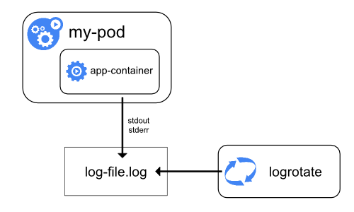

# Evaluate cluster and node logging

## Master Node(s)

### ETCD

Usually, most etcd implementations also include etcdctl, which can aid in monitoring the state of the cluster. If you’re unsure where to find it, execute the following:

`find / -name etcdctl`


Leveraging this tool to check the cluster status:


```bash
./etcdctl cluster-health

member 17f206fd866fdab2 is healthy: got healthy result from https://master-0.etcd.cfcr.internal:2379
```


The cluster this was executed on has only one master node, hence only one result from the script. You will normally receive a response for each etcd member in the cluster.

Alternatively, leverage kubectl get componentstatuses:


```
kubectl get componentstatuses

NAME                 STATUS    MESSAGE             ERROR
scheduler            Healthy   ok                   
controller-manager   Healthy   ok                   
etcd-1               Healthy   {"health":"true"}    
etcd-0               Healthy   {"health":"true"} 
```

Etcd may also be running as a Pod:

```shell
kubectl logs etcd-ubuntu -n kube-system
```


### Kube-apiserver

This is dependent on the environment for which the Kubernetes platform has been installed on. For systemd based systems:

```bash
journalctl -u kube-apiserver
```
Or

```bash
cat /var/log/kube-apiserver.log
```

Or for instances where Kube-APIserver is running as a static pod:

```
kubectl logs kube-apiserver-k8s-master-03 -n kube-system
```


### Kube-Scheduler

For systemd-based systems

```bash
journalctl -u kube-scheduler
```

Or

```bash
cat /var/log/kube-scheduler.log
```

Or for instances where Kube-Scheduler is running as a static pod:

```bash
kubectl logs kube-scheduler-k8s-master-03 -n kube-system
```


### Kube-Controller-Manager

For systemd-based systems

```
journalctl -u kube-controller-manager
```

Or

```
cat /var/log/kube-controller-manager.log
```

Or for instances where Kube-controller manager is running as a static pod:

```
kubectl logs kube-controller-manager-k8s-master-03 -n kube-system
```


## Worker Node(s)

## CNI

Obviously this is dependent on the CNI in use for the cluster you’re working on. However, using Flannel as an example:

```bash
journalctl -u flanneld
```

If running as a pod, however:

```shell
Kubectl logs --namespace kube-system <POD-ID> -c kube-flannel
kubectl logs --namespace kube-system weave-net-pwjkj -c weave
```


### Kube-Proxy

For systemd-based systems

```shell
journalctl -u kube-proxy
```

Or

```shell
cat /var/log/kube-proxy.log
```

Or for instances where Kube-proxy manager is running as a static pod:

```
kubectl logs kube-proxy -n kube-system
```

### Kubelet

```shell
journalctl -u kubelet
```

Or

```shell
cat /var/log/kubelet.log
```

### Container Runtime

Similarly to the CNI, this depends on which container runtime has been deployed, but using Docker as an example:

For systemd-based systems:

```shell
journalctl -u docker.service
```

Or

```shell
cat /var/log/docker.log
```

Hint : list the contents of `etc/systemd/system `if it’s a systemd-based service (containerd.service may be here)

## Cluster Logging

At a cluster level, `kubectl get events` provides a good overview.

#  Understand how to monitor applications

This section is a bit open-ended as it highly depends on what you have deployed and the topology of an application. Typically, however, we have a application that runs as a number of inter-connected **microservices**, consequently we monitor our applications by monitoring the underlying objects that comprise it, such as:

* Pods
* Deployments 
* Services
* etc

## Manage container stdout & stderr logs



Kubernetes handles and redirects any output generated from a containers stdout and stderr streams. These get directed through a logging driver which influences where to store these logs. Different implementations of Docker differ (such as RHEL's implementation) but commonly, these drivers will write to a file in json format:

```shell
root@ubuntu:~# docker info | grep "Logging Driver"
 Logging Driver: json-file
```

The location for these logs is typically `/var/log/containers` but can be tweaked. Additionally, these contain symlinks:

```shell
root@ubuntu:~# ls -la /var/log/containers/
total 44
drwxr-xr-x  2 root root   4096 Feb  8 19:18 .
drwxrwxr-x 11 root syslog 4096 Feb 12 00:00 ..
lrwxrwxrwx  1 root root    100 Feb  8 19:17 coredns-74ff55c5b-j4trd_kube-system_coredns-5d65324791ffcdf45d3552d875c6834f9a305c5be84b18745cb1657f784e5dd0.log -> /var/log/pods/kube-system_coredns-74ff55c5b-j4trd_4afbef57-5592-4edb-96af-9d17f595d160/coredns/0.log
lrwxrwxrwx  1 root root    100 Feb  8 19:17 coredns-74ff55c5b-wrgkr_kube-system_coredns-b2fcfa679e9725dbe601bc1a0f218121a9c44b91d7300bbb57039a4edd219991.log -> /var/log/pods/kube-system_coredns-74ff55c5b-wrgkr_b64ac6d5-654b-4194-b6a8-5f8aa4c3cbe2/coredns/0.log
lrwxrwxrwx  1 root root     81 Feb  8 19:16 etcd-ubuntu_kube-system_etcd-fcc5bc99932f380781776baa125b6f3be035e18fcec520afb827102e2afce1cd.log -> /var/log/pods/kube-system_etcd-ubuntu_f608198a8b73b3cf090bd15e2823df04/etcd/0.log
lrwxrwxrwx  1 root root    101 Feb  8 19:16 kube-apiserver-ubuntu_kube-system_kube-apiserver-a264bbd54b7f23c8d424b0b368a48fdd1c5dcecc72fca95a460c146b2b5d85f5.log -> /var/log/pods/kube-system_kube-apiserver-ubuntu_212641053a16fa2bb404ccde20f6eaf0/kube-apiserver/0.log
lrwxrwxrwx  1 root root    119 Feb  8 19:17 kube-controller-manager-ubuntu_kube-system_kube-controller-manager-a4ef7fe2b52272ea77f8de2da0989a9bcee757ae778fc08f1786b26b45bf13e1.log -> /var/log/pods/kube-system_kube-controller-manager-ubuntu_7bbe7d37f1b2c7586237165580c2f5c3/kube-controller-manager/0.log
lrwxrwxrwx  1 root root    102 Feb  8 19:05 kube-flannel-ds-rfsfs_kube-system_install-cni-f8762e22fbf17925432682bdb1259a066208c62fa695d09cd6ee9b0cef3d36ba.log -> /var/log/pods/kube-system_kube-flannel-ds-rfsfs_2892d4e3-e326-4b4b-90c0-396fb80863ca/install-cni/0.log
lrwxrwxrwx  1 root root    103 Feb  8 19:05 kube-flannel-ds-rfsfs_kube-system_kube-flannel-f96e019717814d7360e1aacd275cac121c13e0ee94cc5c93dcb35365608e6f83.log -> /var/log/pods/kube-system_kube-flannel-ds-rfsfs_2892d4e3-e326-4b4b-90c0-396fb80863ca/kube-flannel/0.log
lrwxrwxrwx  1 root root     96 Feb  8 19:17 kube-proxy-l52f9_kube-system_kube-proxy-bfe08cb8663b46551e8608c094194ec61d03edfa7d25a6f414c07ed6563ada89.log -> /var/log/pods/kube-system_kube-proxy-l52f9_d2b73ed1-5df4-4a18-9595-20798db4f110/kube-proxy/0.log
lrwxrwxrwx  1 root root    101 Feb  8 19:17 kube-scheduler-ubuntu_kube-system_kube-scheduler-4a695e53684f4591ec9385d6944f7841c0329aa49be220e5af6304da281cb41a.log -> /var/log/pods/kube-system_kube-scheduler-ubuntu_69cd289b4ed80ced4f95a59ff60fa102/kube-scheduler/0.log
```

# Troubleshoot application failure

This is a somewhat ambitious topic to cover as how we approach troubleshooting application failures varies by the architecture of that application, which resources/API objects we're leveraging, if the application contains logs. However, good starting points would include running things like:

* `kubectl describe <object>`
* `kubectl logs <podname>`
* `kubectl get events`

# Troubleshoot cluster component failure

Covered in "Evaluate cluster and node logging"

# Troubleshoot networking

## DNS Resolution

`Pods` and `Services` will automatically have a DNS record registered against `coredns` in the cluster, aka "A" records for IPv4 and "AAAA" for IPv6. The format of which is:

`pod-ip-address.my-namespace.pod.cluster-domain.example`
`my-svc-name.my-namespace.svc.cluster-domain.example`

Pod DNS records resolve to a single entity, even if the Pod contains multiple containers as they share the same networking space.

Service DNS records resolve to a the respective service object.

Pods will automatically have their DNS resolution configured based on coredns settings. This can be validated by opening a shell to the pod and inspecting /etc/resolv.conf:

```shell
> kubectl exec -it web-server sh
kubectl exec [POD] [COMMAND] is DEPRECATED and will be removed in a future version. Use kubectl kubectl exec [POD] -- [COMMAND] instead.
/ # cat /etc/resolv.conf 
nameserver 10.43.0.10
search default.svc.cluster.local svc.cluster.local cluster.local eu-central-1.compute.internal
options ndots:5
```

`10.43.0.10` being the coredns service object:

```shell
> kubectl get svc -n kube-system 
NAME                         TYPE        CLUSTER-IP      EXTERNAL-IP   PORT(S)                        AGE
kube-dns                     ClusterIP   10.43.0.10      <none>        53/UDP,53/TCP,9153/TCP         16d
```

To test resolution, we can run a pod with `nslookup` to test. For the pod below:

```shell
> kubectl get po -o wide
NAME         READY   STATUS    RESTARTS   AGE     IP           NODE              NOMINATED NODE   READINESS GATES
web-server   1/1     Running   0          2d20h   10.42.1.31   ip-172-31-36-67   <none>           <none>
```
Knowing the format of the A record:

`pod-ip-address.my-namespace.pod.cluster-domain.example`

We should be able to resolve `10-42-1-31.default.pod.cluster.local`. Tip : To determine the cluster domain, inspect the coredns configmap. Below indiciating `cluster.local`.

```shell
> kubectl get cm coredns -n kube-system -o yaml
apiVersion: v1
data:
  Corefile: |
    .:53 {
        errors
        health {
          lameduck 5s
        }
        ready
        kubernetes cluster.local in-addr.arpa ip6.arpa {
```

Create a Pod with the tools required:

```shell
kubectl apply -f https://k8s.io/examples/admin/dns/dnsutils.yaml
```

Test lookup:

```shell
kubectl exec -i -t dnsutils -- nslookup 10-42-1-31.default.pod.cluster.local
```

```shell
> kubectl exec -i -t dnsutils -- nslookup 10-42-1-31.default.pod.cluster.local
Server:         10.43.0.10
Address:        10.43.0.10#53

Name:   10-42-1-31.default.pod.cluster.local
Address: 10.42.1.31
```

Similarly, for a service, in this case a service called `nginx-service` that resides in the defualt namespace:


```shell
> kubectl exec -i -t dnsutils -- nslookup nginx-service.default.svc.cluster.local
Server:         10.43.0.10
Address:        10.43.0.10#53

Name:   nginx-service.default.svc.cluster.local
Address: 10.43.0.223
```

```shell
> kubectl get svc
NAME            TYPE        CLUSTER-IP    EXTERNAL-IP   PORT(S)   AGE
nginx-service   ClusterIP   10.43.0.223   <none>        80/TCP    9m15s
```

## CNI Issues

Mainly covered earlier in acquiring logs for the CNI. However, one issue that might occur is when a CNI is incorrectly, or not initialised. This may cause workloads to enter a `pending` status:


```shell
kubectl get po -o wide
NAME    READY   STATUS    RESTARTS   AGE   IP       NODE     NOMINATED NODE   READINESS GATES
nginx   0/1     Pending   0          57s   <none>   <none>   <none>           <none>
```

`kubectl describe <pod>` can help identify issues with assigning IP addresses to nodes from the CNI

## Port Checking

Similarly with leveraging `nslookup` to validate DNS resolution in our cluster, we can lean on other tools to perform other diagnostic. All we need is a pod that has a utility like `netcat`, `telnet` etc.
