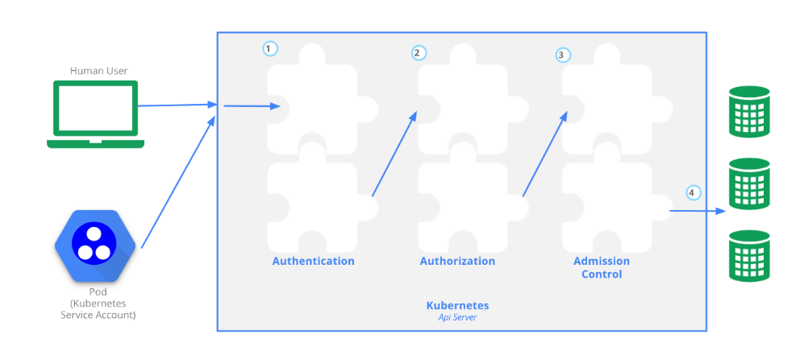
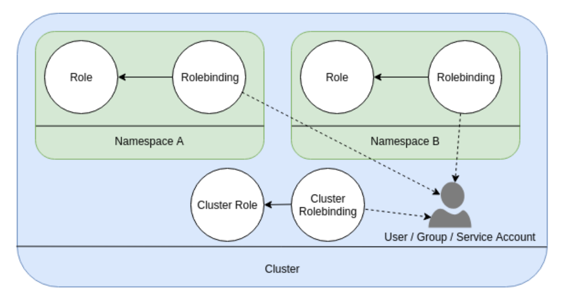
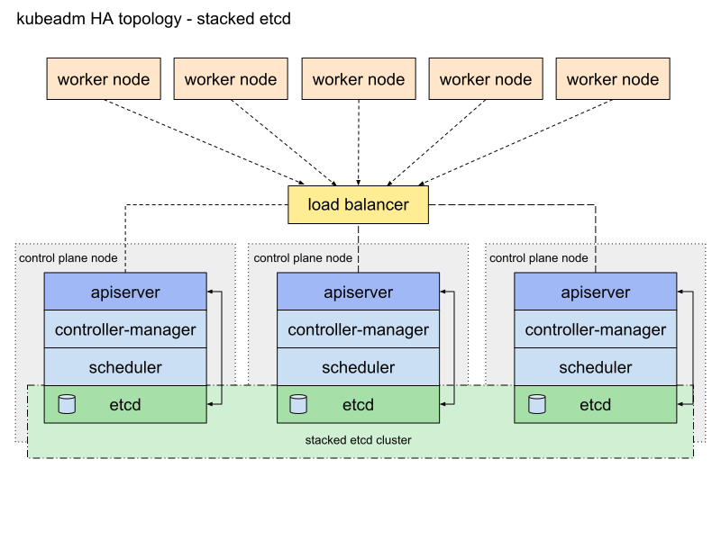
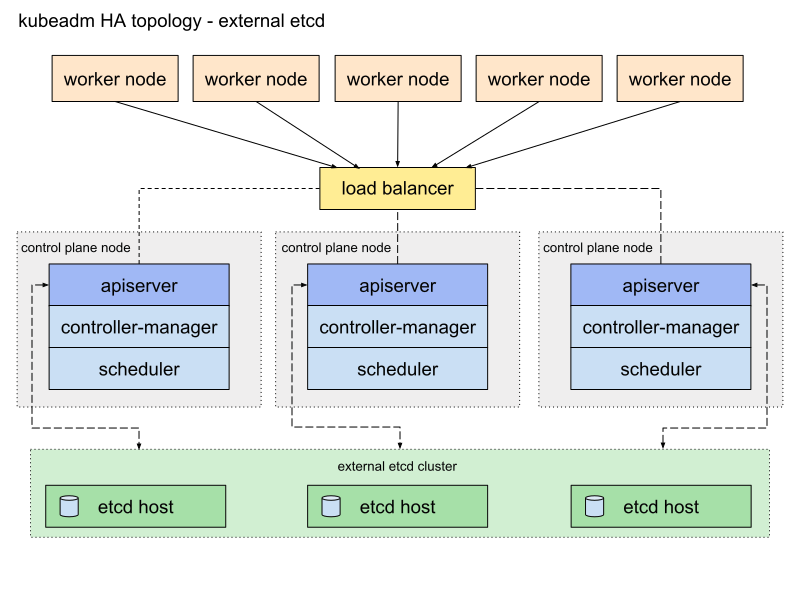

# Cluster Architecture, Installation & Configuration

## Manage Role Based Access Control (RBAC)

Kubernetes implements an RBAC framework to govern access to resources within a cluster and forms part of the overall Authentication, Authorization and Admission control framework.



To determine who (or what) has access to which resources, a number of steps have to be executed.

### Step 1 - Authentication

First step is Authentication which is how a user or service account identifies itself. Depending on the source, a corresponding authentication module is used. Authentication modules include the ability to authenticate from the following:

* Client Certificate
* Password
* Plain Tokens
* Bootstrap Tokens
* JWT Tokens (for service accounts)

All authentication is handled via HTTP over TLS.

### Step 2 - Authorization

After a user or service account is authenticated, the request must then be authorized. Any authentication request is followed by some kind of action request, and the action defines the object(s) that request needs to apply to, and what the action is. For example, to list the pods in a given namespace.

Any and all requests are facilitated providing an existing policy gives the user those permissions.

### Steps 3 & 4 - Admission Control

Admission Control Modules are software modules that can modify or reject requests. In addition to the attributes available to Authorization Modules, Admission Control Modules can access the contents of the object that is being created or updated. They act on objects being created, deleted, updated or connected (proxy), but not reads.

### `Role` and `Rolebindings`

Implementing RBAC rules largely involves two object types within Kubernetes - `role` and `rolebindings`:



A `role` grants access to resources within a single namespace.

A `rolebinding` grants the permissions from a role to a user, group or service account within a single namespace.

`clusterrole` and `clusterrolebindings` operate similarly, but obviously provide access to non-namespaced resources.

`kubectl api-resources --namespaced=false` can be used to determine which resource types are not namespaced. Examples include: `node`, `persistentvolume`, `storageclass` and `users`.

`Users` can either be `serviceaccounts` or `users`. The former is typically used to authenticate applications, the latter for human users.

To test, the below creates `namespace`, `serviceaccount`, `role` and `rolebinding`

```yaml
apiVersion: v1
kind: Namespace
metadata:
 name: rbac-test
```

```yaml
apiVersion: v1
kind: ServiceAccount
metadata:
 name: rbac-test-sa
 namespace: rbac-test
 ```

of particular importance is the format of the below.  
`apiGroup` : Determines which API group to apply this to.
`resources`: Which resource types to apply this to.
`verbs`: What we can do to these objects (ie create, delete, watch, etc)

```yaml
apiVersion: rbac.authorization.k8s.io/v1
kind: Role
metadata:
 name: rbac-test-role
 namespace: rbac-test
rules:
 - apiGroups: [""]
   resources: ["pods"]
   verbs: ["get", "list", "watch"]
```

```yaml
apiVersion: rbac.authorization.k8s.io/v1
kind: RoleBinding
metadata:
 name: rbac-test-rolebinding
 namespace: rbac-test
roleRef:
 apiGroup: rbac.authorization.k8s.io
 kind: Role
 name: rbac-test-role
subjects:
- kind: ServiceAccount
  name: rbac-test-sa
  namespace: rbac-test
```

We can then validate this with kubectl. The following returns yes as that service account can get pods

```shell
kubectl -n rbac-test --as=system:serviceaccount:rbac-test:rbac-test-sa auth can-i get pods
yes
```

However with `secrets`, it returns `no`

```shell
kubectl -n rbac-test --as=system:serviceaccount:rbac-test:rbac-test-sa auth can-i get secrets
no
```

## Use Kubeadm to install a basic cluster

kubeadm is a utility to bootstrap Kubernetes to a number of existing, vanilla nodes. It takes care of the etcd cluster, Kubernetes master and worker nodes including all the required components to instantiate a viable minimum k8s cluster.

What you get at the end of using kubeadm is a fully working, fully functioning kubernetes cluster.

It's at the opposite end of the spectrum in terms of difficulty compared to, for example, Kelsey Hightower's "Kubernetes the hard way".

For the exam, it is recommended that you become familiar with both ways of deploying Kubernetes clusters.

Kubeadm is a command line utility that performs the following functions:

* **kubeadm init** to bootstrap a Kubernetes control-plane node
* **kubeadm join** to bootstrap a Kubernetes worker node and join it to the cluster
* **kubeadm upgrade** to upgrade a Kubernetes cluster to a newer version
* **kubeadm config** if you initialized your cluster using kubeadm v1.7.x or lower, to configure your cluster for kubeadm upgrade
* **kubeadm token** to manage tokens for kubeadm join
* **kubeadm reset** to revert any changes made to this host by kubeadm init or kubeadm join
* **kubeadm version** to print the kubeadm version
* **kubeadm alpha** to preview a set of features made available for gathering feedback from the community

### Kubeadm - Master Node Install

In the following examples 3x Ubuntu Server VMs were created

* k8s-cl02-ms01
* k8s-cl02-wk01
* k8s-cl02-wk02

Where appropriate, ensure your nodes have a container runtime installed.

On the master node install the required binaries

```shell
apt-get update && apt-get install -y apt-transport-https curl
curl -s https://packages.cloud.google.com/apt/doc/apt-key.gpg | apt-key add -
cat <<EOF >/etc/apt/sources.list.d/kubernetes.list
deb https://apt.kubernetes.io/ kubernetes-xenial main
EOF
apt-get update
apt-get install -y kubelet kubeadm kubectl
apt-mark hold kubelet kubeadm kubectl
```

Initialise the master node:

```shell
sudo kubeadm init --pod-network-cidr=10.244.0.0/16
```

Note, the requirement to pass --pod-network is dependent on the chosen CNI. For Flannel, this is required. Kubeadm will also let you know if any prerequisites are not made.

Once completed, a message will be displayed:

```shell
Your Kubernetes control-plane has initialized successfully!

To start using your cluster, you need to run the following as a regular user:

  mkdir -p $HOME/.kube
  sudo cp -i /etc/kubernetes/admin.conf $HOME/.kube/config
  sudo chown $(id -u):$(id -g) $HOME/.kube/config

You should now deploy a pod network to the cluster.
Run "kubectl apply -f [podnetwork].yaml" with one of the options listed at:
  https://kubernetes.io/docs/concepts/cluster-administration/addons/

Then you can join any number of worker nodes by running the following on each as root:

kubeadm join 172.16.10.80:6443 --token j5nqhd.cnfmnjgc68aato60 \
    --discovery-token-ca-cert-hash sha256:cbc91031c1ffa47bbea83aa1cf65e99821a1f582c4363e1a4408715bfd66bb60 
```

Some important pieces of information to note:

* Kubeadm has created the admin kubeconfig file for you, and recommends copying this to the logged on users home directory for ease

* Kubeadm has **not** deployed a pod networking solution yet. Therefore, this is a post-install activity

* Kubeadm has provided a join command together with a token to add worker nodes. We can regenerate this token if required.

If we issue a kubectl get nodes command we will see the master node is not ready

```shell
NAME            STATUS     ROLES    AGE     VERSION
k8s-cl02-ms01   NotReady   master   6m20s   v1.20.2
```

As per the output of kubeadm, install a network solution, Ie flannel.

For flannel to work correctly, you must pass --pod-network-cidr=10.244.0.0/16 to kubeadm init.

Additionally, set /proc/sys/net/bridge/bridge-nf-call-iptables to 1 by running `sysctl net.bridge.bridge-nf-call-iptables=1`.

Install Flannel:

```shell
kubectl apply -f https://raw.githubusercontent.com/coreos/flannel/master/Documentation/kube-flannel.yml
```

After a few seconds, the master node will now be ready

```shell
NAME            STATUS   ROLES    AGE   VERSION
k8s-cl02-ms01   Ready    master   10m   v1.20.2

```

### Kubeadm - Install worker nodes

The installation process for worker nodes is similar to master nodes - the only exception is we do **not** execute the "kubeadm init" command, as this is only run on masters. For workers, we use "kubeadm join".

As prep:

* Install a container runtime
* Install the kubeadm binaries (as above)

To join a worker node to a cluster created by kubeadm we need to use the kubeadm join command with a token generated on the master. This is shown after we run kubeadm init on the master node. However, we can easily regenerate this on the master node should it not be noted down or expired:

(on the master node)

```shell
david@k8s-cl02-ms01:~$ kubeadm token create --print-join-command
kubeadm join 172.16.10.80:6443 --token ht55yv.8lq69q0189xhe2ql     --discovery-token-ca-cert-hash sha256:cbc91031c1ffa47bbea83aa1cf65e99821a1f582c4363e1a4408715bfd66bb60
```

Use this command on the worker (as root)

```shell
root@k8s-cl02-wk01:~# kubeadm join 172.16.10.80:6443 --token ht55yv.8lq69q0189xhe2ql     --discovery-token-ca-cert-hash sha256:cbc91031c1ffa47bbea83aa1cf65e99821a1f582c4363e1a4408715bfd66bb60
```

After which confirmation will be displayed:

```shell
This node has joined the cluster:
* Certificate signing request was sent to apiserver and a response was received.
* The Kubelet was informed of the new secure connection details.

Run 'kubectl get nodes' on the control-plane to see this node join the cluster.
```

To validate, run kubectl get nodes on the master node:

```shell
NAME            STATUS   ROLES    AGE     VERSION
k8s-cl02-ms01   Ready    master   50m     v1.20.2
k8s-cl02-wk01   Ready    <none>   2m10s   v1.20.2
```

## Manage a highly-available Kubernetes cluster

The previous section demonstrated creating a K8s cluster with one master node and several worker nodes - this does not provide resilience for the control plane. Several topologies exist for doing so:

### Stacked etcd



* Multiple worker nodes
* Multiple control plane nodes fronted by a loadbalancer
* Embedded etcd within control plane

Notes:

etcd is quorum based. Therefore, if using stacked control plane nodes with etcd, odd numbers must be used.

### External etcd



Notes:

* Multiple worker nodes
* Multiple control plane nodes fronted by a loadbalancer
* Etcd is external of the k8s cluster

Notes:

Advantage with this setup is etcd and the control plane can be scaled and managed independently of each other. This provides greater flexibility at the expense of operational complexity.

### Assessing cluster health

`kubectl get componentstatus` is deprecated as of 1.20. A suitable replacement includes probing the API server directly, For example, on a master node, run `curl -k https://localhost:6443/livez?verbose` which returns:

```shell
[+]ping ok
[+]log ok
[+]etcd ok
[+]poststarthook/start-kube-apiserver-admission-initializer ok
[+]poststarthook/generic-apiserver-start-informers ok
.....etc
```

Three endpoints exist - `healthz`,`livez` and `readyz` to indicate the current status of the API server

## Provision underlying infrastructure to deploy a Kubernetes cluster

The topology choices above will influence the underlying resources that need to be provisioned. How these are provisioned are specific to the underlying cloud provider. Some generic observations:

* Disable swap.
* Leverage cloud capabilities for HA - ie using multiple AZ's.
* Windows can be used for worker nodes, but not control plane.

## Perform a version upgrade on a Kubernetes cluster using Kubeadm

First, install kubeadm to a specific version. This will determine the k8s version that it deploys:

```shell
sudo apt-get update && sudo apt-get install -y kubeadm=1.19.0-00 kubelet=1.19.0-00 kubectl=1.19.0-00 && sudo apt-mark hold kubeadm
```

Stand up a k8s cluster

```shell
sudo kubeadm init --pod-network-cidr=10.244.0.0/16
```

Add CNI

```shell
https://raw.githubusercontent.com/coreos/flannel/master/Documentation/kube-flannel.yml
```

To upgrade the underlying k8s cluster, we need to upgrade kubeadm.

Update kubeadm

```shell
sudo apt-mark unhold kubeadm
sudo apt-get install --only-upgrade kubeadm
```

Next we `plan` the upgrade - this won't change our cluster but will display what changes can be made:

```shell
sudo kubeadm upgrade plan

Components that must be upgraded manually after you have upgraded the control plane with 'kubeadm upgrade apply':
COMPONENT   CURRENT       AVAILABLE
kubelet     1 x v1.19.0   v1.20.2

Upgrade to the latest stable version:

COMPONENT                 CURRENT   AVAILABLE
kube-apiserver            v1.19.7   v1.20.2
kube-controller-manager   v1.19.7   v1.20.2
kube-scheduler            v1.19.7   v1.20.2
kube-proxy                v1.19.7   v1.20.2
CoreDNS                   1.7.0     1.7.0
etcd                      3.4.9-1   3.4.13-0

You can now apply the upgrade by executing the following command:

kubeadm upgrade apply v1.20.2
```

**Important note:** kubelet must be upgraded manually after this step.

Upgrade the cluster:

```shell
kubeadm upgrade apply v1.20.2
```

upgrade Kubelet:

```shell
sudo apt-get install --only-upgrade kubelet kubectl
```

## Implement etcd backup and restore

### Backing up etcd

Take a snapshot of the DB, then store it in a safe location:

```bash
ETCDCTL_API=3 etcdctl snapshot save snapshot.db --cacert /etc/kubernetes/pki/etcd/server.crt --cert /etc/kubernetes/pki/etcd/ca.crt --key /etc/kubernetes/pki/etcd/ca.key
```

Verify the backup:

```shell
sudo ETCDCTL_API=3 etcdctl --write-out=table snapshot status snapshot.db
+----------+----------+------------+------------+
|   HASH   | REVISION | TOTAL KEYS | TOTAL SIZE |
+----------+----------+------------+------------+
| 2125d542 |   364069 |        770 |  3.8 MB    |
+----------+----------+------------+------------+
```

### Restore to etcd

To perform a restore:

```shell
ETCDCTL_API=3 etcdctl snapshot restore snapshot.db
```
