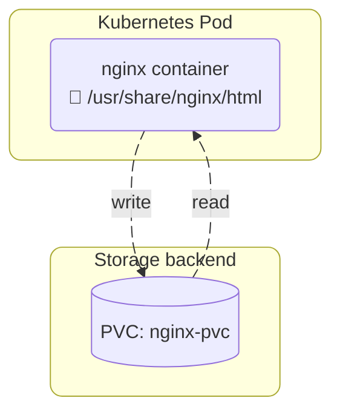
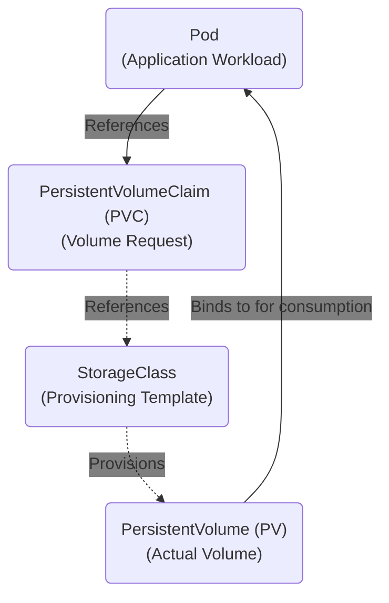

# Implement storage classes and dynamic volume provisioning

## Volume Provisioning

In order to decouple running application code and its persistent data, we leverage the `PersistentVolumeClaim` API. This effectively carves out storage from a specific provider for the application to consume.

A provider in this context can be a cloud vendor (ie AWS, Google, Azure) and on premises providers (ie NetAPP, Dell Technologies, etc).

Given the example in the previous page, lets expand on this so that persistent data is captured in a `PersistentVolumeClaim`

```yaml
apiVersion: apps/v1
kind: Deployment
metadata:
  namespace: default
  name: nginx-deployment
spec:
  selector:
    matchLabels:
      app: nginx-demo
  replicas: 1
  template:
    metadata:
      labels:
        app: nginx-demo
    spec:
      volumes:
        - name: html-storage
          persistentVolumeClaim:
            claimName: nginx-pvc
      containers:
        - name: nginx-container
          image: nginx:1.31.6
          ports:
            - containerPort: 80
              protocol: TCP
          volumeMounts:
            - name: html-storage
              mountPath: /usr/share/nginx/html
---
apiVersion: v1
kind: PersistentVolumeClaim
metadata:
  name: nginx-pvc
  namespace: default
spec:
  storageClassName: longhorn
  accessModes:
    - ReadWriteOnce
  resources:
    requests:
      storage: 1Gi
```

We've performed a number of changes from the original manifest:

* Changed the `Deployment` spec to include `volumes` and `volumeMounts`.

`.spec.volumes` indicates "Within this pod, theres a volume, this volume is based off the claim called "nginx-pvc".

`.spec.volumeMounts` indicates "Within this container *inside this pod* we're going to take the aforementioned persistent volume and mount it to `/usr/share/nginx/html`.

* Created a `PersistentVolumeClaim` object that provides the actual storage.

By doing so, anything that gets written to `/usr/share/nginx/html` inside the Pod will persist even if the pod is terminated.

Let's test this theory:

```bash
# Get the Pod Name
NAME                                    READY   STATUS    RESTARTS   AGE
pod/nginx-deployment-767d55ff87-55zf8   1/1     Running   0          3m47s

NAME                              STATUS   VOLUME                                     CAPACITY   ACCESS MODES   STORAGECLASS   VOLUMEATTRIBUTESCLASS   AGE
persistentvolumeclaim/nginx-pvc   Bound    pvc-dcf22320-f45a-486b-9c11-ea97a6311d64   1Gi        RWO            longhorn       <unset>                 3m48s

# Exec into the Pod
david@fedora:~/cka$ kubectl exec -it nginx-deployment-767d55ff87-55zf8 -- bash

# Overwrite the default index.html
root@nginx-deployment-767d55ff87-55zf8:/# echo "<h1>Welcome CKA Students</h1>" > /usr/share/nginx/html/index.html

# Validate
root@nginx-deployment-767d55ff87-55zf8:/# curl localhost
<h1>Welcome CKA Students</h1>

# Exit out of the container
root@nginx-deployment-767d55ff87-55zf8:/# exit

# Delete the Pod
david@fedora:~/cka$ kubectl delete po nginx-deployment-767d55ff87-55zf8

# Get the new Pod name
david@fedora:~/cka$ kubectl get po
NAME                                READY   STATUS    RESTARTS   AGE
nginx-deployment-767d55ff87-6xn2k   1/1     Running   0          10s

# Test
david@fedora:~/cka$ kubectl exec nginx-deployment-767d55ff87-6xn2k -- curl -s localhost
<h1>Welcome CKA Students</h1>
```

The Pod was deleted and rescheduled, but the data persisted. Because the Pod spec references a PVC, it is re-attached once rescheduled.

We're now dealing with two distinct object types, a Kubernetes `Pod` , and a `PersistentVolumeClaim`. Their life cycles are independent of one another.



## Storage Classes

You may be wondering, how the "magic" happens when we request storage, and part of that is `StorageClasses`.

!!! tip "Tip"

    The `StorageClass` API is the backbone of dynamic volume provisioning in Kubernetes. 

A `StorageClass` provides a way for administrators to describe the "classes" of storage they offer. Different classes might map to quality-of-service levels, or to backup policies, or to arbitrary policies determined by the cluster administrators. Kubernetes itself is un-opinionated about what classes represent. This concept is sometimes called "profiles" in other storage systems.

An example of a storage class is below:

```yaml
apiVersion: storage.k8s.io/v1
kind: StorageClass
metadata:
  name: standard
provisioner: kubernetes.io/aws-ebs
parameters:
  type: gp2
reclaimPolicy: Retain
allowVolumeExpansion: true
volumeBindingMode: Immediate
```

Key parts of the specification are:

* `provisioner` : Determines which volume plugin to use. This usually matches to a cloud provider, and a specific storage service that it offers. In this example AWS Elastic Block Store. It could also be a on premises NetAPP, Dell Technologies array, etc.

* `parameters` : Describe characteristics of this storage class in context of the underlying provisioner. In this example, the `type` is `gp2` which, in AWS vernacular relates General Purpose SSD. Other types include `IO1` (Provisioned IOPS), `ST1` (Throughput Optimised) and `STC` (Cold Storage). Difference storage providers will have different parameters.

We've thrown around a number of different API's, so here's how they relate to each other:



We can see the storage classes available in a cluster by running the following:

```bash
david@fedora:~/cka$ kubectl get storageclass
NAME                 PROVISIONER             RECLAIMPOLICY   VOLUMEBINDINGMODE   ALLOWVOLUMEEXPANSION   AGE
longhorn (default)   driver.longhorn.io      Delete          Immediate           true                   37d
longhorn-static      driver.longhorn.io      Delete          Immediate           true                   37d
standard             kubernetes.io/aws-ebs   Retain          Immediate           true                   17h
```

A cluster can have multiple `StorageClasses`. One of these instances can be designated the `default`. This is the `StorageClass` that will be used to satisfy a `PersistentVolumeClaim` when no `StorageClass` is explicitly defined as part of its manifest.

A `StorageClass` is typically backed by a Container Storage Interface driver, which is a workload deployed to the Kubernetes cluster that typically also creates the `StorageClass` object. In my example, I have `longhorn` installed, we can view its components like so:

```bash
david@fedora:~/cka$ kubectl get po -n longhorn | grep csi

csi-attacher-866df4b764-4b558                       1/1     Running   6 (5d ago)     37d
csi-attacher-866df4b764-77msg                       1/1     Running   5 (5d1h ago)   37d
csi-attacher-866df4b764-f7l9k                       1/1     Running   6 (5d ago)     37d
csi-provisioner-5c696f97cd-7jnxr                    1/1     Running   4 (5d ago)     28d
csi-provisioner-5c696f97cd-7rl8d                    1/1     Running   4 (5d1h ago)   28d
csi-provisioner-5c696f97cd-sf65k                    1/1     Running   5 (5d ago)     28d
csi-resizer-7dd456f456-4dq2b                        1/1     Running   4 (5d ago)     28d
csi-resizer-7dd456f456-4klnq                        1/1     Running   5 (5d ago)     28d
csi-resizer-7dd456f456-pm6l5                        1/1     Running   4 (5d ago)     28d
csi-snapshotter-7997dc5fcd-l6kq5                    1/1     Running   4 (5d ago)     28d
csi-snapshotter-7997dc5fcd-wtkrx                    1/1     Running   3 (5d1h ago)   28d
csi-snapshotter-7997dc5fcd-z5lmr                    1/1     Running   4 (5d ago)     28d
longhorn-csi-plugin-bp4tl                           3/3     Running   9 (5d1h ago)   28d
longhorn-csi-plugin-rxqth                           3/3     Running   11 (5d ago)    28d
longhorn-csi-plugin-t4w2m                           3/3     Running   13 (5d ago)    28d
longhorn-csi-plugin-wkjgd                           3/3     Running   9 (5d1h ago)   28d
```

Note different `Pods` have different responsibilities. For this particular CSI, these include attaching storage to the correct node, resizing (if supported), snapshotting, etc.

## Exam Flashcards

!!! success "Exam Tip"

    When thinking about dynamic storage provisioning, think `StorageClasses`.


!!! success "Exam Tip"

    Unsure what kind of storage is available in your cluster? Run `kubectl get storageclass`.

!!! success "Exam Tip"

    Unsure what capabilities a particular storage class has? run `kubectl describe storageclass <name>` where you will see descriptors like:

    `allowVolumeExpansion: true`  
    `reclaimPolicy: "Delete"`  

!!! success "Exam Tip"

    Have a cluster with no `StorageClass` objects? You can either

    * Create the object manually with vendor-specific parameters
    * Install the respective CSI driver that may have the option to create it for you

!!! success "Exam Tip"

    PVC's wil no explicit `StorageClass` attribute will use the `StorageClass` marked as default. You may *not* have a default `StorageClass`, but can set it with

    `kubectl patch storageclass <your-class-name> -p '{"metadata": {"annotations":{"storageclass.kubernetes.io/is-default-class":"true"}}}'`