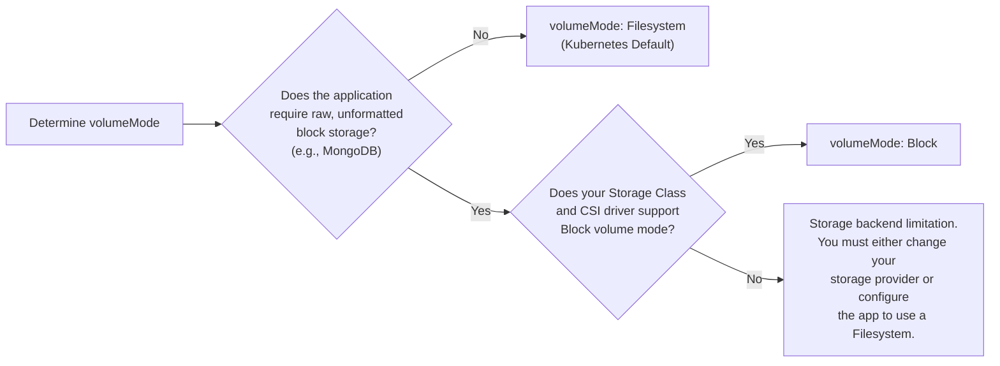
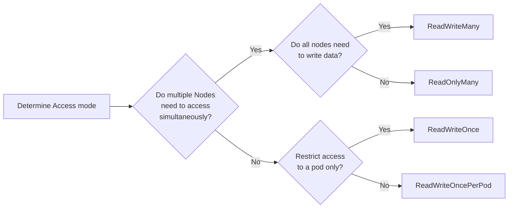

# Configure volume types, access modes and reclaim policies

## Overview

Two volume types exist:

* `Block` - Mounted to a pod as a raw block device (e.g., `/dev/xvda`) *without* a filesystem. The Pod / application needs to understand how to deal with raw block devices. Presenting it in this way can yield better performance, at the expense of complexity.

* `Filesystem` - Mounted inside a pods' filesystem inside a directory. If the volume is backed by a block device with no filesystem, Kubernetes will create one. Compared to `block` devices, this method offers the highest compatibility, at the expense of performance.

We can specify which we want inside the respective `PersistentVolumeClaim` spec:

```yaml hl_lines="10"
apiVersion: v1
kind: PersistentVolumeClaim
metadata:
  name: nginx-pvc
  namespace: default
spec:
  storageClassName: longhorn
  accessModes:
    - ReadWriteOnce
  volumeMode: Block # Or Filesystem
  resources:
    requests:
      storage: 1Gi
```

!!! tip "Tip"

    Although the `PersistentVolume` is consumed by the `Pod`, it is mounted onto the `node` that's running the `Pod`. Hence, when we describe the differences between the access modes, we refer to the node that does the mounting.


Four types of access modes exist:

| Mode                | Abbreviation   | Description                                                              | Storage backend example  |
| ------------------  | -------------- |--------------------------------------------------------------------------|--------------------------|
| `ReadWriteOnce`     | `RWO`          | The volume can be mounted as read-write by a single node                 | Block (Longhorn, EBS)    |
| `ReadWriteOncePod`  | `RWOP`         | The volume can be mounted as read-write by a single pod on a single node | Block (Longhorn, EBS)    |
| `ReadOnlyMany`      | `ROX`          | The volume can be mounted read-only by many nodes                        | File (NFS, EFS)          |
| `ReadWriteMany`     | `RWX`          | The volume can be mounted as read-write by many nodes                    | File (NFS, EFS)          |

We define this as part of the PVC spec:

```yaml hl_lines="8 9"
apiVersion: v1
kind: PersistentVolumeClaim
metadata:
  name: nginx-pvc
  namespace: default
spec:
  storageClassName: longhorn
  accessModes:
    - ReadWriteOnce
  volumeMode: Block # Or Filesystem
  resources:
    requests:
      storage: 1Gi
```

A decision we need to make is which storage type and access mode to use. This is largely driven by the application requirements. We could apply the following thought process to the volume type:




And for the Access Mode:



Reclaim Policies determine what happens to the `PersistentVolume` object when its associated `PersistentVolumeClaim` is deleted. Two main modes exist:

* `Retain` (Default for static provisioning) - When the `PersistentVolumeClaim` is deleted, <span style="color: green;">***preserve***</span> the underlying `PersistentVolume` object and consequently, all its data.
* `Delete` (Default for dynamic provisioning) - When the `PersistentVolumeClaim` is deleted <span style="color: red;">***destroy***</span> the underlying `PersistentVolume` object and consequently, all its data

If you're using dynamic provisioning (leveraging `StorageClasses`), `Delete` is the default.

```yaml hl_lines="10"
apiVersion: v1
kind: PersistentVolumeClaim
metadata:
  name: nginx-pvc
  namespace: default
spec:
  storageClassName: longhorn
  accessModes:
    - ReadWriteOnce
  persistentVolumeReclaimPolicy: Retain # Or Delete
  volumeMode: Block
  resources:
    requests:
      storage: 1Gi
```

## Exam Flashcards

!!! success "Exam Tip"

    Both the `AccessMode` and `VolumeMode` are attributes of the `PersistentVolumeClaim` object.


!!! success "Exam Tip"

    Not all storage providers support all `AccessModes` and `VolumeModes`.


!!! success "Exam Tip"

    Generally speaking, `ReadWriteMany` requirements are satisfied by File System storage protocols such as NFS. Whereas `ReadWriteOnce` is facilitated by Block storage.

!!! success "Exam Tip"

    Reclaim policies are determined at the `PersistentVolumeMode` level. `Retain` preserves the `PersistentVolume` when the associated `PersistentVolumeClaim` is deleted, where as `Delete` destroys the `PersistentVolume`. Choose wisely!