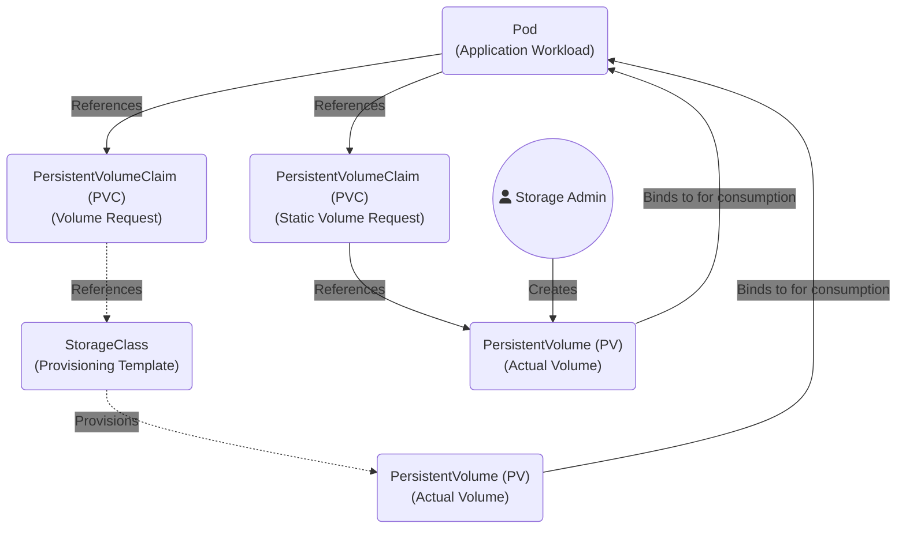

# Manage persistent volumes and persistent volume claims

## Overview

A `PersistentVolume` is a allocation of storage from some kind of provider.
A `PersistentVolumeClaim` is a workload request for storage that will map to a suitable `PersistentVolume`.
Even with dynamic provisioning leveraging `StorageClass` objects, both the `PersistentVolume` and `PersistentVolumeClaim` objects will be deployed. The former is abstracted away.

A `PersistentVolume` is a cluster-scoped API. We present this storage to the entire cluster for consumption.
A `PersistentVolumeClaim` is a namespace-scoped API. We reference this in our workloads which are also cluster scoped.

There is a strict 1:1 mapping between a `PersistentVolumeClaim` and a `PersistentVolume`. This relationship is called a binding. Once bound, the relationship is exclusive.

This relationship is further defined having the following attributes:

* **No sharing of leftover space** - If your PVC requests 5GB of storage, and Kubernetes binds it to an available 10GB `PersistentVoluume.`, the remaining 5GB on that volume cannot be claimed by another PVC. You can, however, if the CSI driver supports it, *expand* the volume at a later date.
* **Many Pods can reference a single `PersistentVolumeClaim`** - While you cannot bind multiple `PersistentVolumeClaims` to a single `PersistentVolume`, you can have multiple Pods mount the exact same PVC (provided the storage backend supports the ReadWriteMany access mode).

The flow graph below depicts both scenarios : Static and Dynamic provisioning.



Like with other API objects in Kubernetes, we interact with storage-specific API's the same way, for example:

To list the current `PersistentVolumes`

```bash
david@fedora:~/cka$ kubectl get pv
NAME                                       CAPACITY   ACCESS MODES   RECLAIM POLICY   STATUS   CLAIM                                                                                                                STORAGECLASS   VOLUMEATTRIBUTESCLASS   REASON   AGE
pvc-24b49b9d-f035-438c-b508-9132b672af1b   30Gi       RWO            Delete           Bound    virtual-machines/fedora-workstation-43-pvc                                                                           longhorn       <unset>                          38d
pvc-4100c254-020e-4323-9cd8-9eee23532eee   5Gi        RWO            Delete           Bound    kanboard/kanboard-pvc                                                                                                longhorn       <unset>                          38d
pvc-bc92e08f-55f4-4d65-8698-6d49f9777820   100Gi      RWO            Delete           Bound    kube-prometheus-stack/prometheus-kube-prometheus-stack-prometheus-db-prometheus-kube-prometheus-stack-prometheus-0   longhorn       <unset>                          38d
pvc-dcf22320-f45a-486b-9c11-ea97a6311d64   1Gi        RWO            Delete           Bound    default/nginx-pvc                                                                                                    longhorn       <unset>                          23h
```
Note these are cluster-scoped API's

To list the current `PersistentVolumeClaims`:


```bash
david@fedora:~/cka$ kubectl get pvc -A
NAMESPACE               NAME                                                                                           STATUS   VOLUME                                     CAPACITY   ACCESS MODES   STORAGECLASS   VOLUMEATTRIBUTESCLASS   AGE
default                 nginx-pvc                                                                                      Bound    pvc-dcf22320-f45a-486b-9c11-ea97a6311d64   1Gi        RWO            longhorn       <unset>                 23h
kanboard                kanboard-pvc                                                                                   Bound    pvc-4100c254-020e-4323-9cd8-9eee23532eee   5Gi        RWO            longhorn       <unset>                 38d
kube-prometheus-stack   prometheus-kube-prometheus-stack-prometheus-db-prometheus-kube-prometheus-stack-prometheus-0   Bound    pvc-bc92e08f-55f4-4d65-8698-6d49f9777820   100Gi      RWO            longhorn       <unset>                 38d
virtual-machines        fedora-workstation-43-pvc                                                                      Bound    pvc-24b49b9d-f035-438c-b508-9132b672af1b   30Gi       RWO            longhorn       <unset>                 38d
```

Like with other objects, we can easily run `kubectl get/list/edit` as we need. The `PersistentVolumeClaim` definition is likely coupled with the application manifests.

You can modify existing PVC's, but only for a very limited set of parameters, these include:

**Examples of parameters that can be modified**:

* PVC Size (Expand Volume) - If supported by the CSI driver, a `PersistentVolumeClaims` `spec.resources.requests.storage` can be increased to facilitate volume expansion.
* Labels and annotations - To add additional context to these objects.

**Examples of parameters that can not be modified**:##

* PVC Size (Shrink Volume) - Regardless of CSI driver, PVC's cannot be shrunk.
* Access Modes - Once defined, the access mode cannot be changed. Ie from `ReadWriteOnce` to `ReadOnceMany`.
* Storage Class - Once defined, the underlying referenced `StorageClass` object cannot be changed.
* The `PersistentVolume` bound to it - Once a `PersistentVolume` is bound, you cannot point it to a different one at runtime.

## Exam Flashcards

!!! success "Exam Tip"

    A `PersistentVolumeClaim` always maps to a `PersistentVolume` regardless of static or dynamic provisioning

!!! success "Exam Tip"

    If a `PersistentVolumeClaim` is failing to `bind`, check the events for it (`kubectl describe pvc <name>`)

!!! success "Exam Tip"

    If a `PersistentVolume` is failing to initalise. Check the CSI driver Pod logs.

!!! success "Exam Tip"

    A `PersistentVolumeClaim` is largely immutable once configured. Only expanding its size and adding labels/annotations can typically be done (CSI dependent).