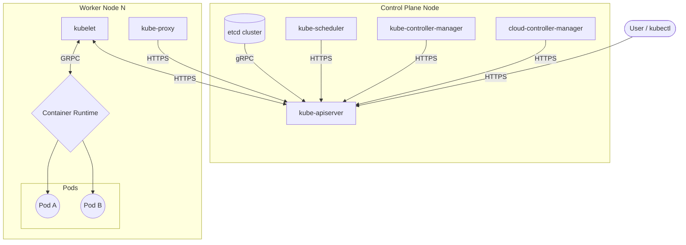

# Troubleshooting

In order to effectively troubleshoot a cluster lets visualise its components at a high level:

```mermaid
flowchart TB

    %% Control Plane
    subgraph ControlPlane [Control Plane Node]
        direction TB
        API[kube-apiserver]
        ETCD[(etcd cluster)]
        SCHED[kube-scheduler]
        CM[kube-controller-manager]
        CCM[cloud-controller-manager]


        %% Internal Control Plane Relationships
        ETCD -->|gRPC| API
        SCHED -->|HTTPS| API
        CM -->|HTTPS| API
        CCM -->|HTTPS| API
    end


    %% Worker Node 1
    subgraph Worker1 [Worker Node N]
        direction TB
        Klet1[kubelet]
        Kproxy1[kube-proxy]
        CR1{Container Runtime}
        
        subgraph Pods1 [Pods]
            direction LR
            Pod1A((Pod A))
            Pod1B((Pod B))
        end

        Klet1 <-->|GRPC| CR1
        CR1 --> Pod1A
        CR1 --> Pod1B
    end

    %% Cluster Communication
    Klet1 <-->|HTTPS| API
    Kproxy1 -->|HTTPS| API

    User([User / kubectl])
    User -->|HTTPS| API

    class ControlPlane controlplane;
    class Worker1,Worker2 worker;
    class Pod1A,Pod1B,Pod2A pod;
    class API core;
```

