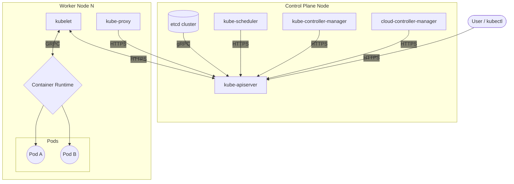

# Troubleshoot clusters and nodes

Reference diagram:



How can we determine the overall health of a cluster? simply running something like `kubectl get nodes` is a good way to test several, key components:

```bash
david@fedora:~/cka$ kubectl get no
NAME         STATUS   ROLES           AGE   VERSION
srv-rk1-01   Ready    control-plane   39d   v1.36.4+k3s1
srv-rk1-02   Ready    <none>          39d   v1.36.4+k3s1
srv-rk1-03   Ready    <none>          39d   v1.36.4+k3s1
srv-rk1-04   Ready    <none>          39d   v1.36.4+k3s1
```

If we can get an output from `kubectl` this tells us that:

* The Kubernetes API server is running and responding to requests
* ETCD is working

In particular, we're looking for the node `status` `role` and `version`

`kubectl describe node <name>` - Enables us to inspect node conditions, for example, if it's exhibiting `MemoryPressure`, `DiskPressure` and allocatable resources

`kubectl get events --sort-by-'.lastTimestamp'` - Presents a list of cluster wide events, sorted in chronological order to spot systemic issues such as scheduling failures.

`journalctl -u kubelet` - Run this directly on a node to inspect the `kubelet` service logs if a node is not reporting a `Ready` status.
