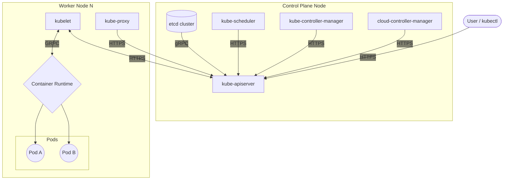

# Troubleshoot cluster components

Reference diagram:




## Control Plane Node Components

### ETCD

Usually, most etcd implementations also include etcdctl, which can aid in monitoring the state of the cluster. If you’re unsure where to find it, execute the following:

`find / -name etcdctl`

Leveraging this tool to check the cluster status:

```bash
etcdctl --write-out=table --endpoints=$ENDPOINTS endpoint status


+------------------------+------------------+---------+---------+-----------+------------+-----------+------------+--------------------+--------+
|        ENDPOINT        |        ID        | VERSION | DB SIZE | IS LEADER | IS LEARNER | RAFT TERM | RAFT INDEX | RAFT APPLIED INDEX | ERRORS |
+------------------------+------------------+---------+---------+-----------+------------+-----------+------------+--------------------+--------+
| https://127.0.0.1:2379 | 4e30a295f2c3c1a4 |   3.6.5 |  8.1 MB |      true |      false |         3 |       7903 |               7903 |        |
+------------------------+------------------+---------+---------+-----------+------------+-----------+------------+--------------------+--------+
```

The cluster this was executed on has only one master node, hence only one result from the script. You will normally receive a response for each etcd member in the cluster.

Alternatively, leverage kubectl get componentstatuses:

```bash
kubectl get componentstatuses #ComponentStatus is deprecated in v1.19+

NAME                 STATUS    MESSAGE             ERROR
scheduler            Healthy   ok                   
controller-manager   Healthy   ok                   
etcd-1               Healthy   {"health":"true"}    
etcd-0               Healthy   {"health":"true"} 
```

Etcd may also be running as a Pod:

```shell
kubectl logs etcd -n kube-system
```

### Kube-apiserver

This is dependent on the environment for which the Kubernetes platform has been installed on. For systemd based systems:

```bash
journalctl -u kube-apiserver
```

Or

```bash
cat /var/log/kube-apiserver.log
```

Or for instances where Kube-API server is running as a static pod:

```bash
kubectl logs kube-apiserver-k8s-master-03 -n kube-system
```

### Kube-Scheduler

For systemd-based systems

```bash
journalctl -u kube-scheduler
```

Or

```bash
cat /var/log/kube-scheduler.log
```

Or for instances where Kube-Scheduler is running as a static pod:

```bash
kubectl logs kube-scheduler-k8s-master-03 -n kube-system
```

### Kube-Controller-Manager

For systemd-based systems

```bash
journalctl -u kube-controller-manager
```

Or

```bash
cat /var/log/kube-controller-manager.log
```

Or for instances where Kube-controller manager is running as a static pod:

```bash
kubectl logs kube-controller-manager-k8s-master-03 -n kube-system
```

## Worker Node(s)

### CNI

Obviously this is dependent on the CNI in use for the cluster you’re working on. However, using Flannel as an example:

```bash
journalctl -u flanneld
```

If running as a pod, however:

```shell
Kubectl logs --namespace kube-system <POD-ID> -c kube-flannel
kubectl logs --namespace kube-system weave-net-pwjkj -c weave
```

### Kube-Proxy

For systemd-based systems

```shell
journalctl -u kube-proxy
```

Or

```shell
cat /var/log/kube-proxy.log
```

Or for instances where Kube-proxy manager is running as a static pod:

```bash
kubectl logs kube-proxy -n kube-system
```

### Kubelet

```shell
journalctl -u kubelet
```

Or

```shell
cat /var/log/kubelet.log
```

### Container Runtime

Similarly to the CNI, this depends on which container runtime has been deployed, but using containerd as an example:

For systemd-based systems:

```shell
journalctl -u containerd
```

Or

```shell
cat /var/log/containerd.log
```
