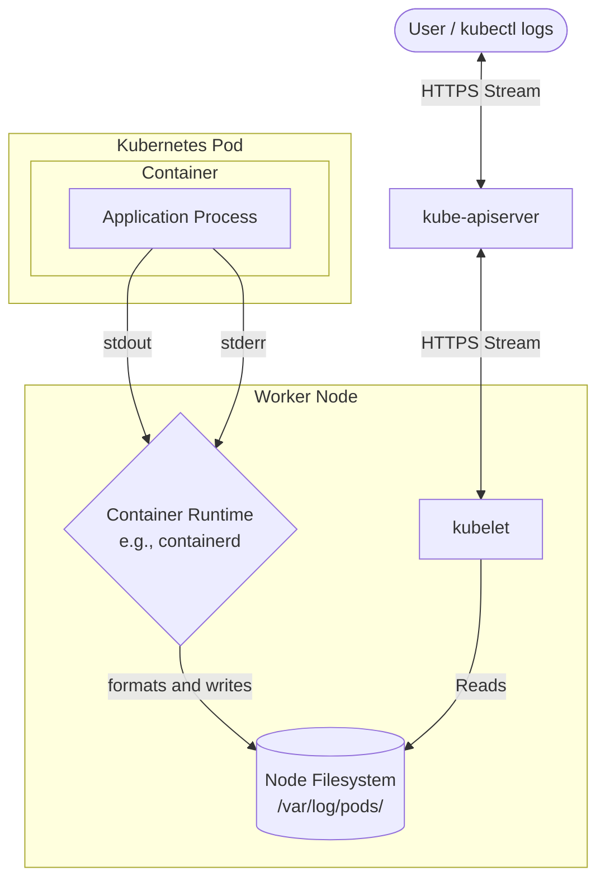

# Manage and evaluate container output streams

A container has two output steams - `stderr` and `stdout`

* `stderr` - Stream used to write diagnostic output from the application. For example, when an error has occured inside the application code, a API call to a third party service fails, etc.
* `stdout` - Stream used to write general-purpose information. For example, debug logging, process completion, etc.

The diagram below depicts this process in more detail:



The flow is like so:

1. The application process inside the container writes logs to `stdout` and `stderr`.
2. The container runtime intercepts these steams.
3. After intercepting these streams, it encodes them (typically as JSON), adding meta data (ie timestamps) and writes it to a log file on the nodes filesystem.
4. When users request these logs, `kubectl` issues a command the the `kube-apiserver`, which, in turn, proxies the request to the `kubelet` on the worker node that's running that Pod. It then reads the log files and streams the output back to the users terminal.

This process retrieves and amalgamates both `stderr` and `stdout` streams. There is no specific distinction between the two.

If you wanted to, you could acess these logs directly on a Worker Node

```bash
david@fedora:~/cka$ ssh ubuntu@172.25.50.241
ubuntu@srv-rk1-01:~$ ls -la /var/log/containers/
total 312
drwxr-xr-x  2 root root   20480 Oct  1 11:23 .
drwxrwxr-x 11 root syslog  4096 Oct  4 00:00 ..
lrwxrwxrwx  1 root root     107 Oct  1 07:50 argocd-dex-server-7b6ccd69b6-h892j_argocd_copyutil-5d5cce7ca69480e8d9333ea12ba70d7be37f3a25f1d95041ca6736a4088c8315.log -> /var/log/pods/argocd_argocd-dex-server-7b6ccd69b6-h892j_1527dc19-6198-4dbd-b5a0-7b1505e1f14f/copyutil/2.log
lrwxrwxrwx  1 root root     109 Sep 28 11:01 argocd-dex-server-7b6ccd69b6-h892j_argocd_dex-server-0b434571aec8482ff5f12a280785ec03ff1c97e822c882b8f77e01fbe9935d23.log -> /var/log/pods/argocd_argocd-dex-server-7b6ccd69b6-h892j_1527dc19-6198-4dbd-b5a0-7b1505e1f14f/dex-server/1.log
lrwxrwxrwx  1 root root     109 Oct  1 07:50 argocd-dex-server-7b6ccd69b6-h892j_argocd_dex-server-7f8fb68181baf8c272f7fdb7279d633051eb4225e18c2d918d96add4bb9ee765.log -> /var/log/pods/argocd_argocd-dex-server-7b6ccd69b6-h892j_1527dc19-6198-4dbd-b5a0-7b1505e1f14f/dex-server/2.log
lrwxrwxrwx  1 root root      99 Sep 28 11:01 argocd-redis-7f9487d4fd-knhpn_argocd_redis-3c39261da0803b21c04bc4ccab6065c6a80c9342a3d125dce15f4b6b20d70cea.log -> /var/log/pods/argocd_argocd-redis-7f9487d4fd-knhpn_de3d27b7-c4bd-4768-928d-16122d686581/redis/1.log
lrwxrwxrwx  1 root root      99 Oct  1 07:50 argocd-redis-7f9487d4fd-knhpn_argocd_redis-a65ee8f70e8b4c47aac3908e0d1be7439e39bea7123df16fee11f04c2f235efa.log -> /var/log/pods/argocd_argocd-redis-7f9487d4fd-knhpn_de3d27b7-c4bd-4768-928d-16122d686581/redis/2.log
```

However, it is far more convenient to use `kubectl logs <podname> -n namespace`. IE:

```bash
david@fedora:~/cka$ kubectl get po
NAME                                READY   STATUS    RESTARTS   AGE
nginx-deployment-767d55ff87-6xn2k   1/1     Running   0          45h
david@fedora:~/cka$ kubectl logs nginx-deployment-767d55ff87-6xn2k
/docker-entrypoint.sh: /docker-entrypoint.d/ is not empty, will attempt to perform configuration
/docker-entrypoint.sh: Looking for shell scripts in /docker-entrypoint.d/
/docker-entrypoint.sh: Launching /docker-entrypoint.d/10-listen-on-ipv6-by-default.sh
10-listen-on-ipv6-by-default.sh: info: Getting the checksum of /etc/nginx/conf.d/default.conf
10-listen-on-ipv6-by-default.sh: info: Enabled listen on IPv6 in /etc/nginx/conf.d/default.conf
/docker-entrypoint.sh: Sourcing /docker-entrypoint.d/15-local-resolvers.envsh
/docker-entrypoint.sh: Launching /docker-entrypoint.d/20-envsubst-on-templates.sh
/docker-entrypoint.sh: Launching /docker-entrypoint.d/30-tune-worker-processes.sh
/docker-entrypoint.sh: Configuration complete; ready for start up
2026/10/05 15:52:51 [notice] 1#1: using the "epoll" event method
```

We can also use `kubectl logs -f <podname> -n namespace` to actively follow (or tail) a Pods logs. This is particularly helpful when recreating an issue and observing a containers reaction.

```bash
david@fedora:~/cka$ kubectl logs -f nginx-deployment-767d55ff87-6xn2k
/docker-entrypoint.sh: /docker-entrypoint.d/ is not empty, will attempt to perform configuration
/docker-entrypoint.sh: Looking for shell scripts in /docker-entrypoint.d/
/docker-entrypoint.sh: Launching /docker-entrypoint.d/10-listen-on-ipv6-by-default.sh
10-listen-on-ipv6-by-default.sh: info: Getting the checksum of /etc/nginx/conf.d/default.conf
10-listen-on-ipv6-by-default.sh: info: Enabled listen on IPv6 in /etc/nginx/conf.d/default.conf
...
```

Want aggregate the logs for all the Pods in a `deployment`? There are two ways:

1. `kubectl logs deployment/<deployment-name>`
2. `kubectl logs -l app=my-app`

```bash
avid@fedora:~/cka$ kubectl get deployment nginx-deployment
NAME               READY   UP-TO-DATE   AVAILABLE   AGE
nginx-deployment   1/1     1            1           2d2h
david@fedora:~/cka$ kubectl describe deployment nginx-deployment | grep -i Labels
Labels:                 <none>
  Labels:  app=nginx-demo
david@fedora:~/cka$ 
david@fedora:~/cka$ 
david@fedora:~/cka$ 
david@fedora:~/cka$ kubectl logs -l app=nginx-demo # or kubectl logs deployment/nginx-deployment
2026/10/05 15:52:51 [notice] 1#1: start worker process 29
2026/10/05 15:52:51 [notice] 1#1: start worker process 30
2026/10/05 15:52:51 [notice] 1#1: start worker process 31
```
