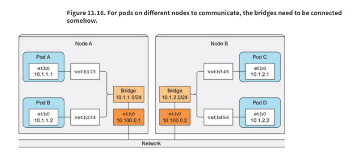
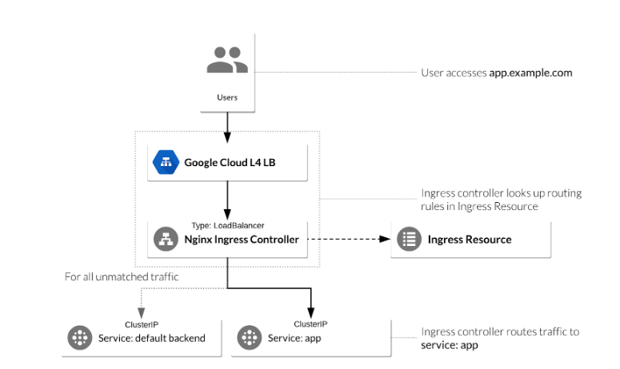

# Services & Networking

## Understand host networking configuration on the cluster nodes



At the host level, we have an interface (typically something like `eth0` or `ens192` etc) that acts as the primary network adapter.  

Each host is responsible for one subnet of the CNI range. In this example, the left host is responsible for 10.1.1.0/24, and the right host 10.1.2.0/24. The overall pod CIDR block may be something like 10.1.0.0/16.

Virtual ethernet adapters are paired with a corresponding Pod network adapter. Kernel routing is used to enable Pods to communicate outside the host it resides in.

## Understand connectivity between Pods

Every Pod gets its own IP address. This means you do not need to explicitly create links between Pods, and you almost never need to deal with mapping container ports to host ports. This creates a clean, backwards-compatible model where Pods can be treated much like VMs or physical hosts from the perspectives of port allocation, naming, service discovery, load balancing, application configuration, and migration.

Kubernetes imposes the following fundamental requirements on any networking implementation (barring any intentional network segmentation policies):

* Pods on a node can communicate with all pods on all nodes without NAT
* Agents on a node (e.g. system daemons, Kubelet) can communicate with all pods on that node

Note: When running workloads that leverage `hostNetwork`:

* Pods in the host network of a node can communicate with all pods on all nodes without NAT

## Understand ClusterIP, NodePort, LoadBalancer service types and endpoint

Pods are ephemeral. Therefore, placing these behind a service which provides a stable, static entrypoint is a fundamental use of the kubernetes service object. To reiterate, services take the form of the following:

* ClusterIP - Internal only
* LoadBalancer - External, requires cloud provider, or software implementation to provide one
* NodePort - External, requires access the nodes directly
* Ingress resource - L7 An Ingress can be configured to give services externally-reachable URLs, load balance traffic, terminate SSL, and offer name based virtual hosting. An Ingress controller is responsible for fulfilling the Ingress, usually with a loadbalancer, though it may also configure your edge router or additional frontends to help handle the traffic.

## Know how to use Ingress controllers and Ingress resources

Ingress exposes HTTP and HTTPS routes from outside the cluster to services within a cluster. Ingress consists of two components. Ingress Resource is a collection of rules for the inbound traffic to reach Services. These are Layer 7 (L7) rules that allow hostnames (and optionally paths) to be directed to specific Services in Kubernetes. The second component is the Ingress Controller which acts upon the rules set by the Ingress Resource, typically via an HTTP or L7 load balancer. It is vital that both pieces are properly configured to route traffic from an outside client to a Kubernetes Service.



The following yaml creates two ingress rules for the website foo.bar.com

The default path will direct traffic to the service “default-service” which listens on port 80

Paths ending in /foo will direct traffic to the service “service1” which listens on port 4200

Paths ending in /bar will direct traffic to the service “service2” which listens on port 8080

```yaml
apiVersion: networking.k8s.io/v1
kind: Ingress
metadata:
  name: simple-fanout-example
spec:
  rules:
    - host: foo.bar.com
      http:
        paths:
          - path: /
            pathType: Prefix
            backend:
              service:
                name: default-service
                port:
                  number: 80
          - path: /foo
            pathType: Prefix
            backend:
              service:
                name: service1
                port:
                  number: 4200
          - path: /bar
            pathType: Prefix
            backend:
              service:
                name: service2
                port:
                  number: 8080
```

In order for the Ingress resource to work, the cluster must have an ingress controller running. Ingress controllers are deployed into the Kubernetes cluster as a workload:

```shell
> kubectl get po -A | grep nginx-ingress
ingress-nginx              nginx-ingress-controller-2gxtd                            1/1     Running     0          14d
ingress-nginx              nginx-ingress-controller-9lrzh                            1/1     Running     0          14d
ingress-nginx              nginx-ingress-controller-r2ksq                            1/1     Running     0          14d
```

## Know how to configure and use CoreDNS

As of 1.13, coredns has replaced kube-dns as the facilitator of cluster DNS and runs as pods.

```shell
kubectl get pods -n kube-system
NAME                                    READY   STATUS    RESTARTS   AGE
coredns-fb8b8dccf-hxbhn                 1/1     Running   9          10d
coredns-fb8b8dccf-jks6g                 1/1     Running   4          8d
```

To view the DNS configuration of a pod, spin one up and inspect the /etc/resolv.conf:

```shell
kubectl run busybox --image=busybox -- sleep 9000
kubectl exec -it busybox sh
/ # cat /etc/resolv.conf  
nameserver 10.96.0.10
search default.svc.cluster.local svc.cluster.local cluster.local virtualthoughts.co.uk
options ndots:5
```

“10.96.0.10” references the `Kube-DNS` service

“Default.svc.cluster.local” References the namespace with the suffix svc.cluster.local.

All pods are provisioned a DNS record and are in the format of

**[Pod IP separated by dashes].[Namespace].[type].[Base Domain Name]**

Where `[type]` is `pod` in this example, put services can be resolved by the same convention.

For example:

```shell
/ # nslookup 10-42-2-68.default.pod.cluster.local
Server: 10.43.0.10
Address: 10.43.0.10:53

Name: 10-42-2-68.default.pod.cluster.local
Address: 10.42.2.68

```

Services follow a similar pattern

**[Service Name].[Namespace].[type].[Base Domain Name]**

For example:

```shell
my-svc.my-namespace.svc.cluster-domain.example
```

Headless services are those without a cluster ip, but will respond with a list of IP’s of pods that are applicable at that particular moment in time.

```yaml
apiVersion: v1
kind: Service
metadata:
  name: test-headless
spec:
  clusterIP: None
  ports:
  - port: 80
    targetPort: 80
  selector:
    app: web-headless
```

We can modify the default behavior of the pod dns configuration in the yaml file:

```yaml
apiVersion: v1
kind: Pod
metadata:
  namespace: default
  name: dns-example
spec:
  containers:
    - name: test
      image: nginx
  dnsPolicy: "None"
  dnsConfig:
    nameservers:
      - 8.8.8.8
    searches:
      - ns1.svc.cluster.local
      - my.dns.search.suffix
    options:
      - name: ndots
        value: "2"
      - name: edns0
```

CoreDNS also has a configmap that can be modified:

```shell
kubectl get cm coredns -n kube-system -o yaml                                                            
apiVersion: v1
data:
  Corefile: |
    .:53 {
        errors
        health
        ready
        kubernetes cluster.local in-addr.arpa ip6.arpa {
          pods insecure
          upstream
          fallthrough in-addr.arpa ip6.arpa
        }
        hosts /etc/coredns/NodeHosts {
          reload 1s
          fallthrough
        }
        prometheus :9153
        forward . /etc/resolv.conf
        cache 30
        loop
        reload
        loadbalance
    }
  NodeHosts: |
    172.16.10.100 k3s-ranch-node-1
    172.16.10.101 k3s-ranch-node-2
    172.16.10.102 k3s-ranch-node-3

```

The Corefile configuration includes the following plugins of CoreDNS:

* `errors`: Errors are logged to stdout.
* `health`: Health of CoreDNS is reported to `http://localhost:8080/health`. In this extended syntax lameduck will make the process unhealthy then wait for 5 seconds before the process is shut down.
* `ready`: An HTTP endpoint on port 8181 will return 200 OK, when all plugins that are able to signal readiness have done so.
* `kubernetes`: CoreDNS will reply to DNS queries based on IP of the services and pods of Kubernetes. You can find more details about that plugin on the CoreDNS website. ttl allows you to set a custom TTL for responses. The default is 5 seconds. The minimum TTL allowed is 0 seconds, and the maximum is capped at 3600 seconds. Setting TTL to 0 will prevent records from being cached. The pods insecure option is provided for backward compatibility with kube-dns. You can use the pods verified option, which returns an A record only if there exists a pod in same namespace with matching IP. The pods disabled option can be used if you don't use pod records.
* `prometheus`: Metrics of CoreDNS are available at `http://localhost:9153/metrics` in Prometheus format (also known as OpenMetrics).
* `forward`: Any queries that are not within the cluster domain of Kubernetes will be forwarded to predefined resolvers (/etc/resolv.conf). cache: This enables a frontend cache.
* `loop`: Detects simple forwarding loops and halts the CoreDNS process if a loop is found.
* `reload`: Allows automatic reload of a changed Corefile. After you edit the ConfigMap configuration, allow two minutes for your changes to take effect.

You can modify the default CoreDNS behavior by modifying the ConfigMap.

## Choose an appropriate container network interface plugin

You must deploy a Container Network Interface (CNI) based Pod network add-on so that your Pods can communicate with each other. Cluster DNS (CoreDNS) will not start up before a network is installed.

[https://kubernetes.io/docs/concepts/cluster-administration/addons/#networking-and-network-policy](https://kubernetes.io/docs/concepts/cluster-administration/addons/#networking-and-network-policy)

As a generalisation, CNI’s provide some kind of network overlay. But each have their own features, limitations and considerations.

CNI's manifest and Kubernetes pods in your cluster. A typical workflow would involve standing up your k8s cluster and applying a network cni with:

```shell
kubectl apply -f <add-on.yaml>
```
