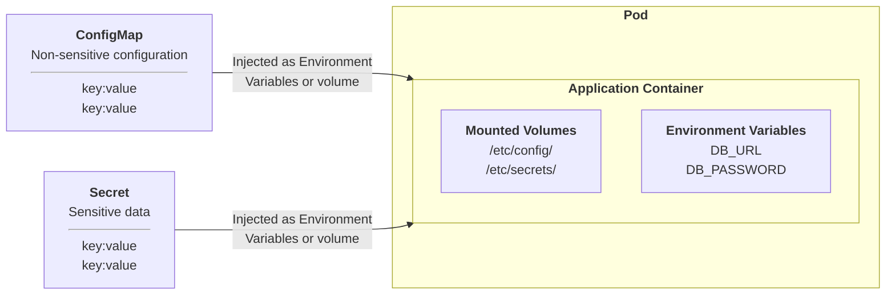

# Use ConfigMaps and Secrets to configure applications

Both `ConfigMaps` and `Secrets` are used to decouple application configuration from the container image. By doing so, we have greater flexibility in changing the behavior of our applications. They can be used in two ways:

* Mounted as a `Volume`
* Injected as a `Environment Variable`

Which to choose is largely dependent on the application and its requirements.



`ConfigMaps` are intended for general purpose application configuration - names, URL's, Application specific environment variables, etc
`Secrets` are intended to store sensitive information - API keys, passwords, certificates, etc.

!!! danger "Danger"

    By default, secrets are only `base64 encoded`. Meaning, cluster administrators can easily decode these secrets. For production clusters, leverage secrets encryption on your chosen platform, either be using direct integration with key vaults, or through third party solutions.

It's incredibly easy to create either of these objects using `kubectl`:

```shell
kubectl create configmap <map-name> <data-source>
```

`Map-name` is an arbitrary name we give to this particular map, and “data-source” corresponds to a key-value pair that resides in the config map.

```shell
kubectl create configmap vt-cm --from-literal=blog=virtualthoughts.co.uk
```

At which point we can then describe it:

```shell
kubectl describe configmap vt-cm
Name:         vt-cm
Namespace:    default
Labels:       <none>
Annotations:  <none>

Data
====
blog:
----
virtualthoughts.co.uk
```

To reference this `ConfigMap` in a pod, we declare it in the respective yaml:

Configmaps can be mounted as `volumes` or `environment variables`. The below example leverages the latter.

```yaml hl_lines="10-15"
apiVersion: v1
kind: Pod
metadata:
 name: config-test-pod
spec:
 containers:
 - name: test-container
   image: busybox
   command: [ "/bin/sh", "-c", "env" ]
   env:
     - name: BLOG_NAME
       valueFrom:
         configMapKeyRef:
           name: vt-cm
           key: blog
```

The pod above will output the environment variables, so we can validate it’s leveraged the config map by extracting the logs from the pod:

```shell
kubectl logs config-test-pod | grep "BLOG_NAME="
...
BLOG_NAME=virtualthoughts.co.uk
...
```

An example that mounts as secret as a volume:

```yaml hl_lines="10-17"
apiVersion: v1
kind: Pod
metadata: 
  name: config-test-pod
spec: 
  containers: 
    - name: test-container   
      image: busybox   
      command: [ "/bin/sh", "-c", "env" ]   
      volumeMounts:
        - name: secret-volume
          mountPath: /etc/secrets
          readOnly: true
  volumes:
    - name: secret-volume
      secret:
        secretName: blog-name
```