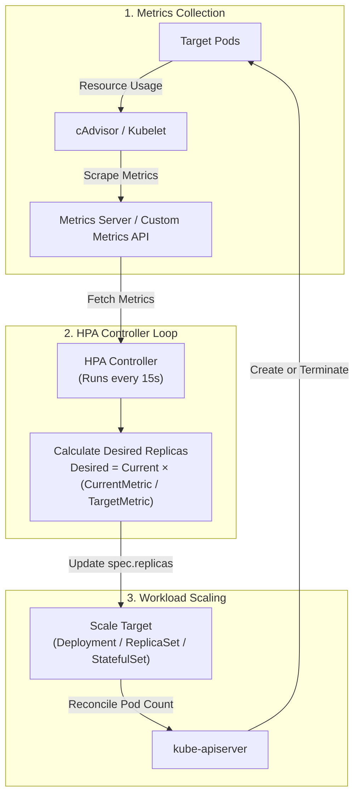
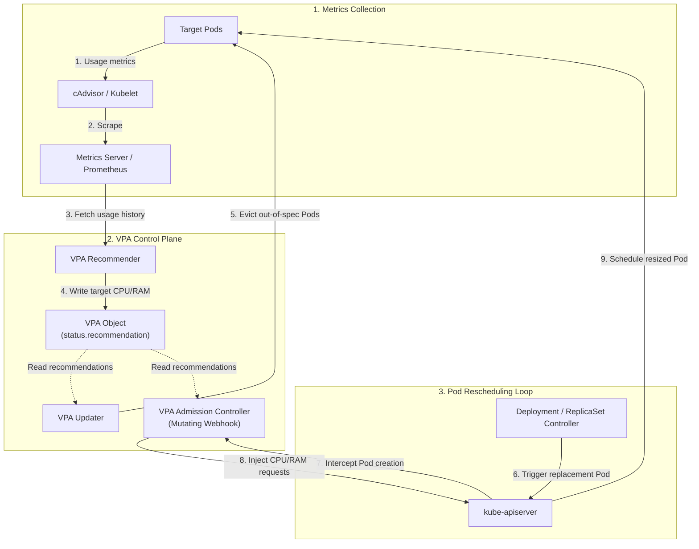

# Configure workload autoscaling

Workload autoscaling relies on several mechanisms in Kubernetes, namely:

* `HPA` - AKA Horizontal Pod Autoscaling, the ability to increase/decrease the number of `replicas` in a `deployment` based on several metrics
* `VPA` - AKA Vertical Pod Autoscaling, the ability to increase/decrease the `resources` of Pods based on several metrics

## Metrics Server

At the core of all  of this is the `metrics server`, a standard Kubernetes component that provides, amongst other things, data to make scaling decisions based off. We interact with the metrics server when we run commands such as `kubectl top nodes`

## Horizontal Pod Autoscaler (HPA)

The HPA is responsible for changing the **number** of pods for a given deployment.

The `HPA` process is visualised below:



The configuration is captured in the `HorizontalPodAutoscaler` object. For example:

```yaml
apiVersion: autoscaling/v2
kind: HorizontalPodAutoscaler
metadata:
  name: my-app-hpa
  namespace: default
spec:
  scaleTargetRef:
    apiVersion: apps/v1
    kind: Deployment
    name: my-app
  minReplicas: 2
  maxReplicas: 10
  metrics:
  - type: Resource
    resource:
      name: cpu
      target:
        type: Utilization
        averageUtilization: 80
```

The way in which the HPA calculates the number of replicas a given deployment should have:

**DesiredReplicas** = ⌈ **CurrentReplicas** × (**CurrentMetricValue** / **TargetMetricValue**) ⌉

Key Attributes:

* `spec.scaleTarget` defines the object we want to scale automatically
* `spec.min/maxReplicas` defines upper and lower limits, so workloads don't scale indefinitely
* `spec.metrics` defines which metric condition triggers scaling. Basic metrics include `cpu` and `memory` but more complicated rules can be created based on custom metrics like `http_requests_per_second`.

## Vertical Pod Autoscaler (VPA)

While HPA changes the *number* of pods, the VPA changes the *size* of the pods by scaling them **up** and **down**.

It works by dynamically adjusting the CPU and Memory `requests` and `limits` of a container based on metrics from the metrics servers.

The `VPA` process is visualised below:



The configuration is captured in the `VerticalPodAutoscaler` object. For example:

```yaml
apiVersion: autoscaling.k8s.io/v1
kind: VerticalPodAutoscaler
metadata:
  name: my-app-vpa
  namespace: default
spec:
  targetRef:
    apiVersion: apps/v1
    kind: Deployment
    name: my-app
  updatePolicy:
    updateMode: "Auto" # Modes: "Auto", "Recreate", "Initial", "Off"
```

Key Attributes:

* `spec.targetRef` defines the object we want to scale automatically
* `spec.updatePolicy` defines the approach to scaling:
  * `off` - Only suggests recommendations.
  * `initial` - Applies recommendations, but only when `new pods` are created
  * `recreate` - Applies recommendations on new and existing Pods.
  * `auto` - The default, which is the same as `recreate`

!!! success "Exam Tip"

    HPA and VPA requires a working metrics server or prometheus instance to make decisions.

!!! success "Exam Tip"

    VPA's will only work on workloads with defined. resource requests and limits.
