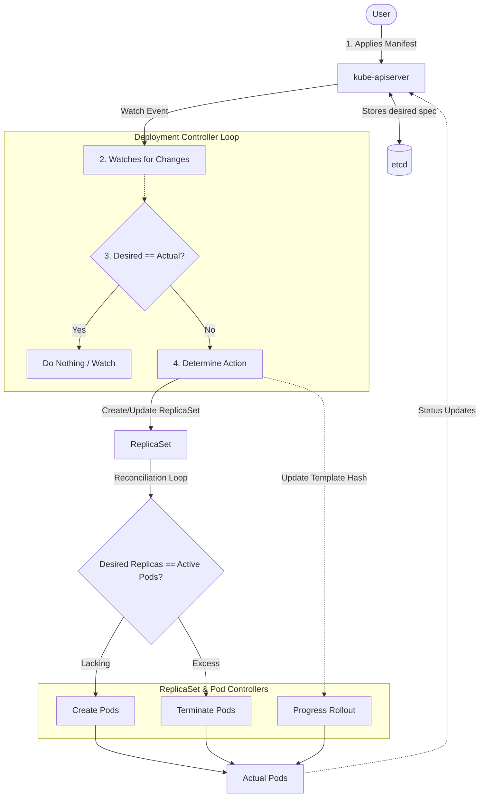
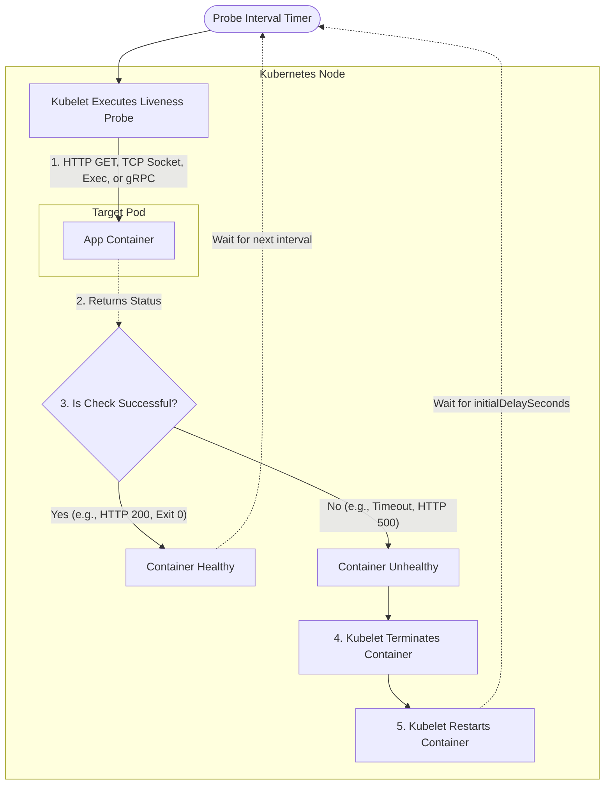
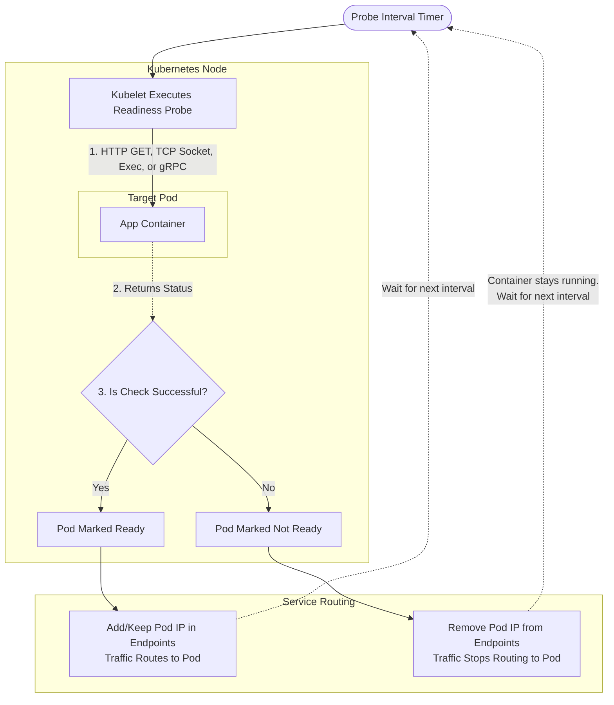
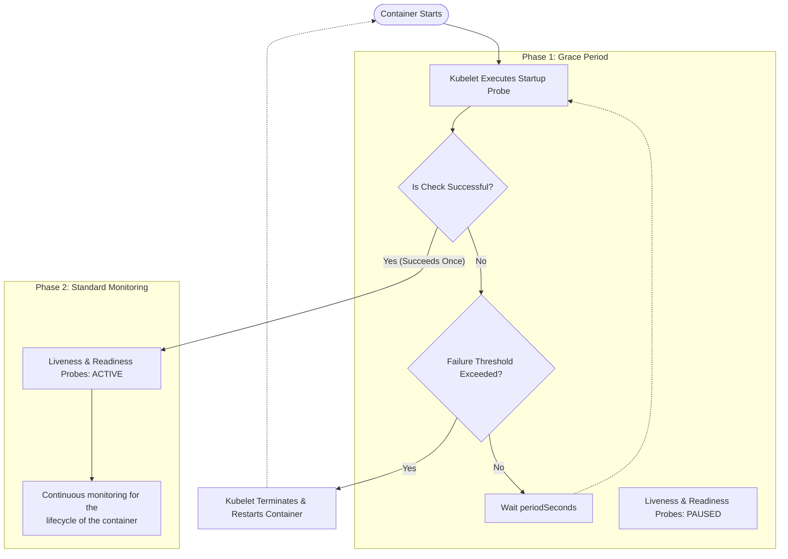

# Understand the primitives used to create robust, self-healing, application deployments

Deployments facilitate this by employing a reconciliation loop to check the number of deployed pods matches what’s defined in the manifest. Under the hood, deployments leverage ReplicaSets, which are primarily responsible for this feature.

## Deployments and Replicasets

Deployments were covered in part 1 but lets dig into the self-healing aspects a bit more:



In a `Deployment` manifest we specify the number of `replicas`:

```yaml hl_lines="10"
apiVersion: apps/v1
kind: Deployment
metadata:
  namespace: default
  name: nginx-deployment
spec:
  selector:
    matchLabels:
      app: nginx-demo
  replicas: 3
....
```

This is what the Kubernetes API will continuously monitor. If this changes, or if the running state does not match the desired state, it takes action.

This differs from running standalone `Pods` - When a `Pod` is terminated, it's gone forever. When a replica in a `Deployment` is terminated, it is replaced.

Not all failures are obvious, a application can be running but deadlocked, or silently failing. This is where probes come in.

A probe is a way of declaring in our workloads what constitutes a Pod needing to be restarted and when it's ready to accept traffic.

## Probes

A `probe` in Kubernetes is a mechanism for determining the state of an application inside a Pod. Namely to establish:

* Is the container alive and functioning properly? (`liveness` probe)
* Is the container ready to receive traffic? (`readiness` probe)
* Is the container finished with its initial boot sequence and ready for standard health monitoring to being? (`startup` probe)

Regardless of which probe to use, they all use the same `type`:

| Probe Type              | YAML Field     | Success Criteria                                                 | Best Use Case                                              |
| ----------------------- | -------------- | -----------------------------------------------------------------|------------------------------------------------------------|
| **HTTP GET**            | `httpGet`      | Returns an HTTP 200 status code                                  | Standard web services and REST APIs.                       |
| **TCP Socket**          | `tcpSocket`    | Successfully establishes a TCP connection on the specified port. | Non-HTTP services like databases or message brokers.       |
| **Command Execution**   | `exec`         | Command completes with a return code of `0`.                     | Custom health scripts or legacy applications.              |
| **gRPC**                | `grpc`         | Application responds with a `SERVING` status.                    | gRPC-native applications                                   |

### Liveness Probe

In this example, the `kubelet` will, every 5 seconds issue a `HTTP GET` command to the container on port 80. If it passes? do nothing. If it fails, terminate it:

```yaml hl_lines="21-27"
apiVersion: apps/v1
kind: Deployment
metadata:
  namespace: default
  name: nginx-deployment
spec:
  selector:
    matchLabels:
      app: nginx-demo
  replicas: 1
  template:
    metadata:
      labels:
        app: nginx-demo
    spec:
      containers:
      - name: nginx
        image: nginx:1.31.6
        ports:
        - containerPort: 80
        livenessProbe:
          httpGet:
            path: /
            port: 80
          initialDelaySeconds: 10
          periodSeconds: 5
          failureThreshold: 3
```

We can visualise this process in the graph below:



### Readiness Probe

In this example, we've added a liveness probe that runs `cat /var/run/nginx.pid`. If this returns `0`, we mark this container as ready to receive traffic.

```yaml hl_lines="28-34"
apiVersion: apps/v1
kind: Deployment
metadata:
  namespace: default
  name: nginx-deployment
spec:
  selector:
    matchLabels:
      app: nginx-demo
  replicas: 1
  template:
    metadata:
      labels:
        app: nginx-demo
    spec:
      containers:
      - name: nginx
        image: nginx:1.31.6
        ports:
        - containerPort: 80
        livenessProbe:
          httpGet:
            path: /
            port: 80
          initialDelaySeconds: 10
          periodSeconds: 5
          failureThreshold: 3
        readinessProbe:
          exec:
            command:
            - cat
            - /var/run/nginx.pid
          initialDelaySeconds: 5
          periodSeconds: 5
```

Which we can visualise in the graph below. Two noteworthy remarks:

1. We can mix `liveness`, `readiness` and `startup` probes together.
2. For `readiness` probes, the Pod is not terminated, it is simply omitted from having traffic routed to it



### Startup Probes

Startup probes are a way of defining a "grace period" to determine a condition that needs to be satisfied before its the target of `liveness` and `readiness` probes. Examples include database migrations or populating caches.

```yaml hl_lines="21-25"
apiVersion: apps/v1
kind: Deployment
metadata:
  namespace: default
  name: nginx-deployment
spec:
  selector:
    matchLabels:
      app: nginx-demo
  replicas: 1
  template:
    metadata:
      labels:
        app: nginx-demo
    spec:
      containers:
      - name: nginx
        image: nginx:1.25
        ports:
        - containerPort: 80        
        startupProbe:
          grpc:
            port: 80
          failureThreshold: 30
          periodSeconds: 10
        livenessProbe:
          httpGet:
            path: /
            port: 80
          initialDelaySeconds: 10
          periodSeconds: 5
          failureThreshold: 3
        readinessProbe:
          exec:
            command:
            - cat
            - /var/run/nginx.pid
          initialDelaySeconds: 5
          periodSeconds: 5
```

which we can visualise in the graph below:



## Restart Policies

A `restartPolicy` is a Pod specification that governs how the nodes `kubelet` should respond when a container inside that Pod terminates, crashes or fails a liveness probe.

Three options exist:

1. `always` - This is the default. The Kubelet will automatically restart the container regardless of why it stopped.
2. `onFailure` - The Kubelet will automatically restart the container only when it exists with a non-zero exit code, or terminated by a `probe`.
3. `never` - The Kubelet will not restart the container **under any circumstances**.

We define it under `.spec.restartPolicy` inside the Pod spec:

```yaml hl_lines="17"
apiVersion: apps/v1
kind: Deployment
metadata:
  namespace: default
  name: nginx-deployment
spec:
  selector:
    matchLabels:
      app: nginx-demo
  replicas: 1
  template:
    metadata:
      labels:
        app: nginx-demo
    spec:
      # Added restartPolicy at the Pod spec level
      restartPolicy: Always
      containers:
      - name: nginx
        image: nginx:1.31.6
        ports:
        - containerPort: 80
```

!!! success "Exam Tip"

    Liveness and readiness `probes` provide a continuous check to establish if our application is healthy.

!!! success "Exam Tip"

    If a liveness probe fails, the Pod is terminated#

!!! success "Exam Tip"

    If a readiness probe fails, the Pod is not terminated, but its endpoint is removed from the service list.

!!! success "Exam Tip"

    Use startup probes for applications that need a grace period upon starting up (ie for initialisation, migrations, pulling down data, etc).