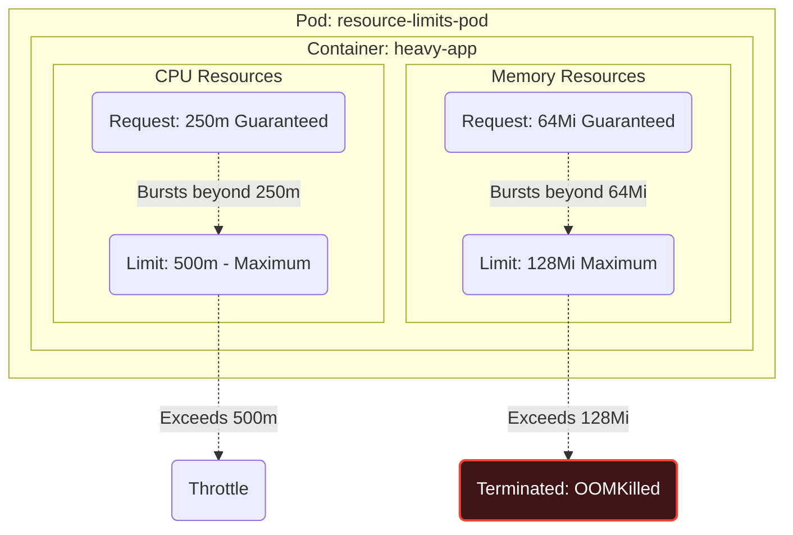

# Configure Pod admission and scheduling limits, node affinity, etc

There are times when we require granularity when it comes to where our workloads get scheduled to, for a plethora of reasons which include:

* Scheduling workloads to GPU enabled Nodes
* Enforcing Pods within a deployment are spread across multiple nodes (mitigate against node failure)
* Enforcing struct resource limitations on workloads to prevent monopolising of resources.
* Many more..

## Pod Admission

Pod admission governs how Kubernetes restricts the resources a Pod can consume, It also validates or modifies Pod creation requests before accepting them into the cluster.

### Resource Request and Limits

A `request` defines the `minimum` amount of CPU and/or memory a container requires to be scheduled. If it cannot be satisfied, it will not be scheduled
A `limit` defines the `maximum` amount of CPU and/or memory a container can consume at any given time. If it exceeds memory usage, it is OOM killed. If it exceeds CPU it is throttled.

```yaml hl_lines="9-15"
apiVersion: v1
kind: Pod
metadata:
  name: resource-limits-pod
spec:
  containers:
  - name: heavy-app
    image: my-app:1.0
    resources:
      requests:
        memory: "64Mi"
        cpu: "250m"
      limits:
        memory: "128Mi"
        cpu: "500m"
```

Which we can visualise like so:



In this example, if this workload exceeds 500m CPU, it will be throttled. If it exceeds 128Mi of RAM, it will be `OOMKilled`

### Limit Ranges

`limitRanges` reside within a specific namespace and enforce minimum and maximum CPU and memory boundaries for individual Pods and Containers. For example:

```yaml
apiVersion: v1
kind: LimitRange
metadata:
  name: standard-limit-range
  namespace: dev-team
spec:
  limits:
  - type: Container
    # Applied automatically if a Pod omits 'limits'
    default:
      cpu: "1"
      memory: "512Mi"
    # Applied automatically if a Pod omits 'requests'
    defaultRequest:
      cpu: "500m"
      memory: "256Mi"
    # Hard boundaries for the namespace
    max:
      cpu: "2"
      memory: "1Gi"
    min:
      cpu: "100m"
      memory: "128Mi"
```

### Resource Quotas

`ResourceQuotas` differ slightly from `LimitRanges` ass they restrict the *total* sum of resources consumed by *all pods* within a specific `namespace`. If a subsequent deployment causes the CPU, memory or Pod could to exceed these hard limits, it will be blocked.

For example:

```yaml
apiVersion: v1
kind: ResourceQuota
metadata:
  name: compute-quota
  namespace: dev-team
spec:
  hard:
    # Maximum total requests across all pods
    requests.cpu: "4"
    requests.memory: "8Gi"
    # Maximum total limits across all pods
    limits.cpu: "8"
    limits.memory: "16Gi"
    # Maximum total number of pods allowed
    pods: "10"
```

## Scheduling Limits

These mechanisms control how the kube-scheduler decides which node a Pod should be placed on based on hardware constraints, topology, or isolation requirements.

### Node Selector

A `nodeSelector` works by only allowing a workload to schedule to a node, or set of nodes that has a corresponding key-value pair. For example:

```yaml hl_lines="9-10"
apiVersion: v1
kind: Pod
metadata:
  name: nodeselector-pod
spec:
  containers:
  - name: nginx
    image: nginx:1.31.6
  nodeSelector:
    disktype: ssd
```

If no nodes have this label, it won't be scheduled.

### Node Affinity

`nodeAffinity` is more complex than a `nodeSelector`. It defines both required and preferred scheduling rules. In the example below, a Pod must be scheduled in zone `us-east-1a` or `us-east-1b`. Among the nodes that meet that requirement, it will prefer nodes that have the `dedicated-gpu` label.

```yaml
apiVersion: v1
kind: Pod
metadata:
  name: node-affinity-pod
spec:
  affinity:
    nodeAffinity:
      # Hard Requirement: Must be in one of these two zones
      requiredDuringSchedulingIgnoredDuringExecution:
        nodeSelectorTerms:
        - matchExpressions:
          - key: topology.kubernetes.io/zone
            operator: In
            values:
            - us-east-1a
            - us-east-1b
      # Preference: Try to place on a GPU node if possible
      preferredDuringSchedulingIgnoredDuringExecution:
      - weight: 50
        preference:
          matchExpressions:
          - key: dedicated-gpu
            operator: Exists
```

### Pod Affinity and Anti-Affinity

Pod affinity rules govern two things:

1. Which Pods to co-locate on the same node (affinity)
2. Which Pods to be spread across different nodes (anti-affinity)

In the example below,

1. `web` Pods are co-located in the same zone as `redis-cache` Pods (affinity).
2. `web` replica Pods are spread across different nodes for HA

```yaml hl_lines="14-37"
apiVersion: apps/v1
kind: Deployment
metadata:
  name: web-deployment
spec:
  replicas: 3
  selector:
    matchLabels:
      app: web
  template:
    metadata:
      labels:
        app: web
    spec:
      affinity:
        # Pod Affinity: Co-locate with Redis cache in the same zone
        podAffinity:
          requiredDuringSchedulingIgnoredDuringExecution:
          - labelSelector:
              matchExpressions:
              - key: app
                operator: In
                values:
                - redis-cache
            topologyKey: topology.kubernetes.io/zone
        # Pod Anti-Affinity: Try not to put two 'web' pods on the same exact node
        podAntiAffinity:
          preferredDuringSchedulingIgnoredDuringExecution:
          - weight: 100
            podAffinityTerm:
              labelSelector:
                matchExpressions:
                - key: app
                  operator: In
                  values:
                  - web
              topologyKey: kubernetes.io/hostname
      containers:
      - name: web-app
        image: nginx:1.36.1
```

!!! success "Exam Tip"

    Workloads exceeding their memory `limit` get `OOMkilled`


!!! success "Exam Tip"

    Affinity rules attract workloads together


!!! success "Exam Tip"

    Anti-Affinity rules repel workloads apart