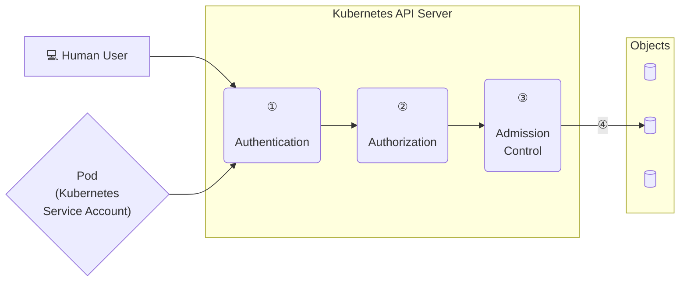
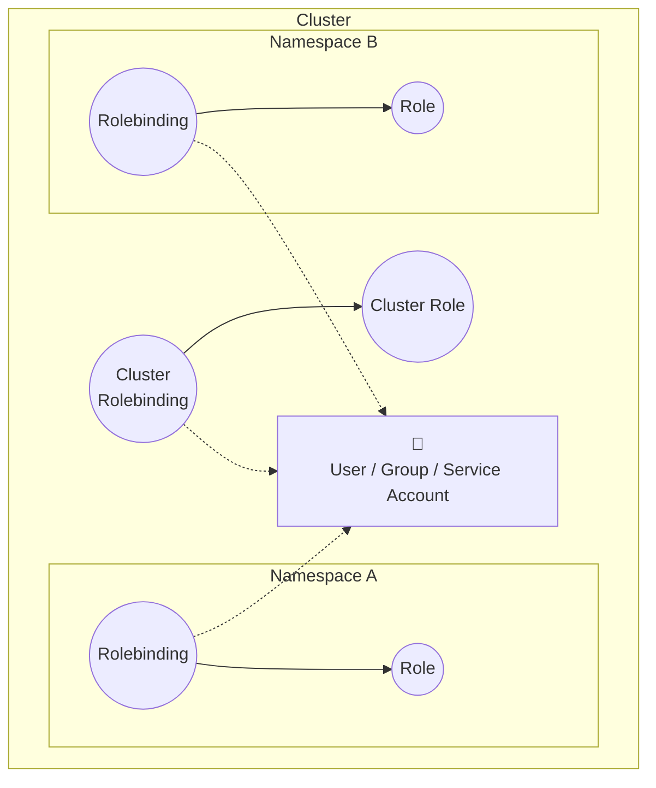

# Manage role based access control (RBAC)

Kubernetes implements an RBAC framework to govern access to resources within a cluster and forms part of the overall Authentication, Authorization and Admission control framework.

Four steps are needed for a Human user or a service account to gain access to a resource:



To determine who (or what) has access to which resources, a number of steps have to be executed.

## Step 1 - Authentication

First step is Authentication which is how a user or service account identifies itself. Depending on the source, a corresponding authentication module is used. Authentication modules include the ability to authenticate from the following:

* Client Certificate
* Password
* Plain Tokens
* Bootstrap Tokens
* JWT Tokens (for service accounts)

All authentication is handled via HTTP over TLS.

## Step 2 - Authorization

After a user or service account is authenticated, the request must then be authorized. Any authentication request is followed by some kind of action request, and the action defines the object(s) that request needs to apply to, and what the action is. For example, to list the pods in a given namespace.

Any and all requests are facilitated providing an existing policy gives the user those permissions.

## Steps 3 & 4 - Admission Control

Admission Control Modules are software modules that can modify or reject requests. In addition to the attributes available to Authorization Modules, Admission Control Modules can access the contents of the object that is being created or updated. They act on objects being created, deleted, updated or connected (proxy), but not reads.

## `Role` and `Rolebindings`

Implementing RBAC rules largely involves two object types within Kubernetes - `role` and `rolebindings`:



A `role` grants access to resources within a single namespace.

A `rolebinding` grants the permissions from a role to a user, group or service account within a single namespace.

`clusterrole` and `clusterrolebindings` operate similarly, but obviously provide access to non-namespaced resources.

`kubectl api-resources --namespaced=false` can be used to determine which resource types are not namespaced. Examples include: `node`, `persistentvolume`, `storageclass` and `users`.

`Users` can either be `serviceaccounts` or `users`. The former is typically used to authenticate applications, the latter for human users.

To test, the below creates `namespace`, `serviceaccount`, `role` and `rolebinding`

```yaml
apiVersion: v1
kind: Namespace
metadata:
 name: rbac-test
```

```yaml
apiVersion: v1
kind: ServiceAccount
metadata:
 name: rbac-test-sa
 namespace: rbac-test
```

of particular importance is the format of the below.  
`apiGroup` : Determines which API group to apply this to.
`resources`: Which resource types to apply this to.
`verbs`: What we can do to these objects (ie create, delete, watch, etc)

```yaml
apiVersion: rbac.authorization.k8s.io/v1
kind: Role
metadata:
 name: rbac-test-role
 namespace: rbac-test
rules:
 - apiGroups: [""]
   resources: ["pods"]
   verbs: ["get", "list", "watch"]
```

```yaml
apiVersion: rbac.authorization.k8s.io/v1
kind: RoleBinding
metadata:
 name: rbac-test-rolebinding
 namespace: rbac-test
roleRef:
 apiGroup: rbac.authorization.k8s.io
 kind: Role
 name: rbac-test-role
subjects:
- kind: ServiceAccount
  name: rbac-test-sa
  namespace: rbac-test
```

We can then validate this with kubectl. The following returns yes as that service account can get pods

```bash
kubectl -n rbac-test --as=system:serviceaccount:rbac-test:rbac-test-sa auth can-i get pods
yes
```

However with `secrets`, it returns `no`

```bash
kubectl -n rbac-test --as=system:serviceaccount:rbac-test:rbac-test-sa auth can-i get secrets
no
```
