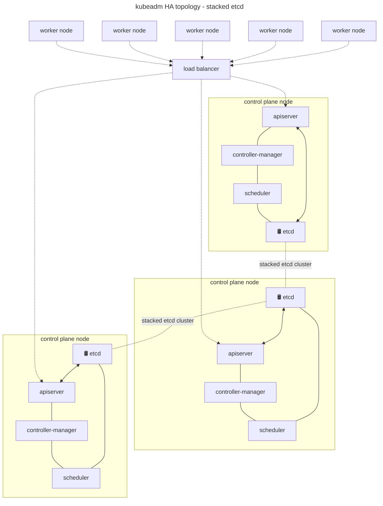
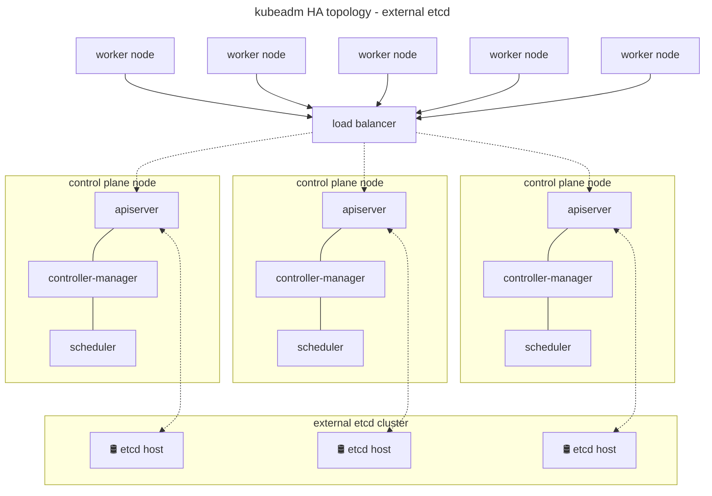

# Implement and configure a highly-available control plane

The previous section demonstrated creating a K8s cluster with one control plane node and several worker nodes - this does not provide resilience for the control plane. Several topologies exist for doing so:

## Stacked etcd

* Multiple worker nodes
* Multiple control plane nodes fronted by a loadbalancer
* Embedded etcd within control plane

Notes:

etcd is quorum based. Therefore, if using stacked control plane nodes with etcd, odd numbers must be used.

### External etcd

Notes:

* Multiple worker nodes
* Multiple control plane nodes fronted by a loadbalancer
* Etcd is external of the k8s cluster

Notes:

Advantage with this setup is etcd and the control plane can be scaled and managed independently of each other. This provides greater flexibility at the expense of operational complexity.

!!! success "Exam Tip"

    etcd is quorum based. Therefore, you need an odd number of nodes greater than one to achieve High Availability. It is common for smaller clusters to colocate the control plane and etcd roles.