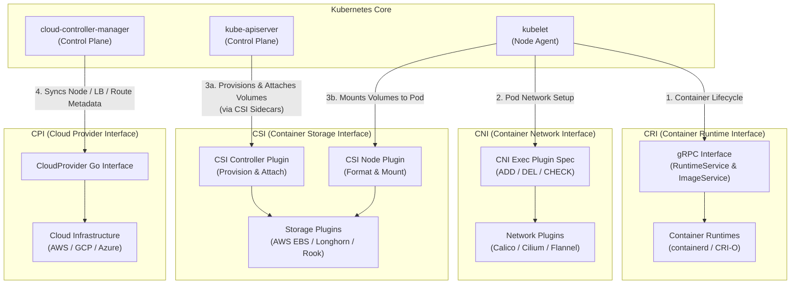

# Understand extension interfaces (CNI, CSI, CRI, etc.)

Kubernetes relies on a modular, plugin-driven architecture powered by standardised extension interfaces. These are known as the CRI (Container Runtime Interface), CNI (Container Network Interface), CSI (Container Storage Interface), and CPI (Cloud Provider Interface) to decouple core orchestration logic from underlying infrastructure.

These interfaces allow Kubernetes components like `kubelet` and the control plane to seamlessly interact with third-party container runtimes, networking fabrics, storage systems, and cloud environments.

This plug-and-play design ensures Kubernetes remains vendor-neutral, highly customizable, and capable of operating consistently across any environment, from bare-metal datacenters to managed cloud platforms.

We can visualise this as so:

Each plugin type has a specific purpose:

| Interface | Full Name | Primary Responsibility | Protocol | Key Examples |
| :--- | :--- | :--- | :--- | :--- |
| **CRI** | Container Runtime Interface | Manages container lifecycles, image pulling, and pod sandboxes on the node | gRPC over Unix Domain Socket | `containerd`, `CRI-O` |
| **CNI** | Container Network Interface | Configures network interfaces, IP address allocation (IPAM), and routes for Pods | Executable binary calls (`ADD`, `DEL`, `CHECK`) | Calico, Cilium, Flannel |
| **CSI** | Container Storage Interface | Handles volume lifecycle (provisioning, attaching, mounting, snapshotting) | gRPC (`Identity`, `Controller`, `Node` services) | AWS EBS CSI, Longhorn, Rook/Ceph |
| **CPI** | Cloud Provider Interface | Integrates Kubernetes control plane with cloud provider infrastructure (Node metadata, LBs, Routes) | Go interface inside `cloud-controller-manager` | AWS, GCP, Azure, OpenStack plugins |
