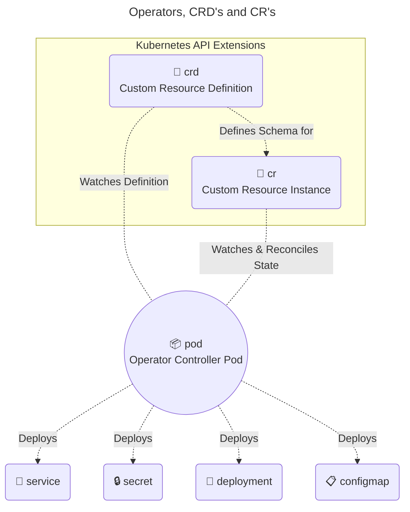

# Understand CRDs, install and configure operators

## Custom Resource Definitions (CRDs)

Kubernetes is designed to be highly extensible. CRDs allow you to introduce your own custom API objects into the cluster without having to modify the core Kubernetes codebase.

We've already used a number of built in API's - `Pods` `Deployments` `Services` etc. `CustomResources` simply put, enable us to make our own API object.

The **Custom Resource Definition (CRD)** defines the schema and structure (the blueprint) using OpenAPI v3 validation. The **Custom Resource (CR)** is the actual instantiated object created from that blueprint.

Once a CRD is registered, its resources act exactly like native components (e.g., Pods or Deployments). You can use standard commands like `kubectl get`, `kubectl describe`, and apply standard RBAC rules to secure them.

We can depict this like so:



A `controller` Pod watches for instances of CRD's that it knows about, and depending on what those `customResources` contain, will then perform a number of additional steps, typically creating other resource types.

A good example of an operator used frequently is the `cert-manager` operator. We can view the CRD's it has created:

```bash
david@fedora:~/cka$ kubectl get crd | grep -i cert-manager.io
certificaterequests.cert-manager.io                           2026-08-29T11:14:37Z
certificates.cert-manager.io                                  2026-08-29T11:14:37Z
challenges.acme.cert-manager.io                               2026-08-29T11:14:37Z
clusterissuers.cert-manager.io                                2026-08-29T11:14:37Z
issuers.cert-manager.io                                       2026-08-29T11:14:37Z
orders.acme.cert-manager.io                                   2026-08-29T11:14:37Z
```

This concept of Custom Resources and Custom Resource Definition follow what is known as the "Operator Pattern"

## The Operator Pattern

Standard Kubernetes controllers (like the Deployment controller) only know how to manage generic stateless applications. They do not know how to handle complex, stateful tasks like database schema upgrades, failovers, or backups.

An Operator encodes human operational knowledge into software.

`CRD (Desired State) + Custom Controller (Active Loop) = Operator`. The custom controller continuously watches the API server for changes to its specific Custom Resources and executes the domain-specific logic required to make the actual cluster state match the desired state.

## Installing and Configuring Operators

While many operators are installed in the real world using package managers like Helm, the fundamental declarative steps required by the CKA are:

1. **Install the CRDs**: First, you must register the new resource types with the Kubernetes API server so it knows how to validate them.
   `kubectl apply -f operator-crds.yaml`.
2. **Deploy the Operator Controller**: Deploy the actual software loop that will watch the new CRDs. This usually consists of a standard Deployment, a dedicated ServiceAccount, and specific ClusterRoles/ClusterRoleBindings so the operator has the necessary permissions to create and manage downstream resources.
   `kubectl apply -f operator-deployment.yaml`.
3. **Verify the Operator**: Ensure the operator Pod is actually running before giving it work.
   `kubectl get pods -n <operator-namespace>`.
4. **Deploy the Custom Resource (CR)**: Finally, pass your configuration to the operator by creating an instance of the CRD. The operator will detect this new object and begin provisioning the underlying infrastructure (Pods, PVCs, Services, etc.).
   `kubectl apply -f custom-app-instance.yaml`.
5. **Troubleshooting**: If your custom application doesn't deploy as expected, you must check the operator's logs to see why it failed to reconcile the resource.
   `kubectl logs deploy/<operator-name> -n <operator-namespace>`.

!!! success "Exam Tip"

    Operators typically deploy with a controller `pod`. This is the entity that watches for instances of specific custom resources and often provides a good starting point for troubleshooting.

!!! success "Exam Tip"

    You can list and filter custom resources in a cluster by running `kubectl get crd`.