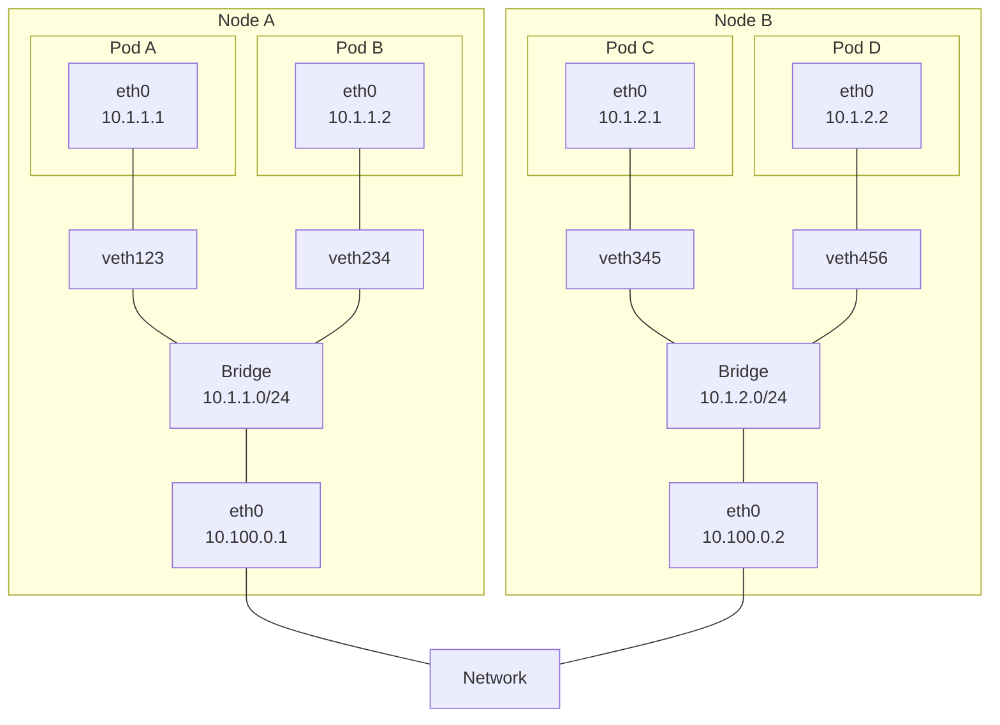

# Understand connectivity between Pods

Every Pod gets its own IP address on a flat network. This means you do not need to explicitly create links between Pods, and you almost never need to deal with mapping container ports to host ports. This creates a clean, backwards-compatible model where Pods can be treated much like VMs or physical hosts from the perspectives of port allocation, naming, service discovery, load balancing, application configuration and migration.

We can visualise this like so:

Kubernetes imposes the following fundamental requirements on any networking implementation (barring any intentional network segmentation policies):

* `Pods` on a node can communicate with all `Pods` on all nodes without NAT.
* Agents on a node (e.g. system daemons, Kubelet) can communicate with all pods on that node.

!!! success "Exam Tip"

    All `pods` inside a cluster operate as if they are on the same L2 network.

!!! success "Exam Tip"

    The `CNI` is responsible for a lot of the networking scaffolding a Pod is subject to.

!!! success "Exam Tip"

    Every `pod` gets an IP address, but `containers` within that Pod share it. Use port numbers to delimitate traffic between them.

!!! success "Exam Tip"

    By default, `pod` IP addresses are not accessible directly from outside the cluster. We use `services` to forward traffic to them from outside of the cluster.