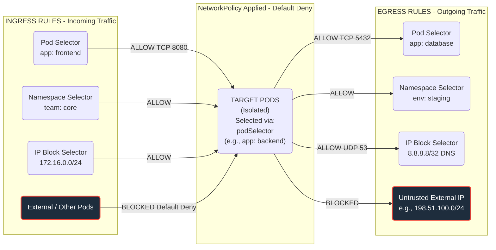

# Define and enforce Network Policies

Network policies control traffic flow at Layer 3 (IP) or Layer 4 (Port) levels. We can define accepted and blocked communication between Pods inside a cluster as well as to the outside world.

We configure these using the `NetworkPolicy` API object

!!! tip "Tip"

    The CNI must explicitly support NetworkPolicies. Not all do!

Let's take the following example:

```yaml
apiVersion: networking.k8s.io/v1
kind: NetworkPolicy
metadata:
  name: backend-network-policy
  namespace: default
spec:
  podSelector:
    matchLabels:
      app: backend
  policyTypes:
    - Ingress
    - Egress
  ingress:
    - from:
        - podSelector:
            matchLabels:
              app: frontend
      ports:
        - protocol: TCP
          port: 8080

    - from:
        - namespaceSelector:
            matchLabels:
              team: core

    - from:
        - ipBlock:
            cidr: 172.16.0.0/24
  egress:
    - to:
        - podSelector:
            matchLabels:
              app: database
      ports:
        - protocol: TCP
          port: 5432
    - to:
        - namespaceSelector:
            matchLabels:
              env: staging
    - to:
        - ipBlock:
            cidr: 8.8.8.8/32
      ports:
        - protocol: UDP
          port: 53
```
Which can be visually represented like so:



!!! tip "Tip"

    In Kubernetes, applying a NetworkPolicy to a pod automatically isolates it (enabling a "Default Deny"). **Any traffic not explicitly listed in the ingress or egress rules will be blocked**, which is how the "External / Other Pods" and "Untrusted External IP" connections are denied.

Let's break this down:

```yaml hl_lines="7-9"
apiVersion: networking.k8s.io/v1
kind: NetworkPolicy
metadata:
  name: backend-network-policy
  namespace: default
spec:
  podSelector:
    matchLabels:
      app: backend
```

`podSelector` defines which `Pods` we want to target for this Network Policy. In this case, it's `Pods` with the label `app:backend` in the default `namespace`

Next we have policy types. We can specify ingress, egress or both:

```yaml
  policyTypes:
    - Ingress
    - Egress
```

Ingress rules permit what can talk ***to*** these Pods:

```yaml
  ingress:
    - from:
        - podSelector:
            matchLabels:
              app: frontend
      ports:
        - protocol: TCP
          port: 8080

    - from:
        - namespaceSelector:
            matchLabels:
              team: core

    - from:
        - ipBlock:
            cidr: 172.16.0.0/24
```

Egress rules permit what these Pods ***can talk to***:

```yaml
  egress:
    - to:
        - podSelector:
            matchLabels:
              app: database
      ports:
        - protocol: TCP
          port: 5432
    - to:
        - namespaceSelector:
            matchLabels:
              env: staging
    - to:
        - ipBlock:
            cidr: 8.8.8.8/32
      ports:
        - protocol: UDP
          port: 53
```

!!! success "Exam Tip"

    Network policies are applied to workloads using label selectors

!!! success "Exam Tip"

    Once a network policy is applied, only traffic explicitly defined is permitted, synonymous to a "deny-all" approach