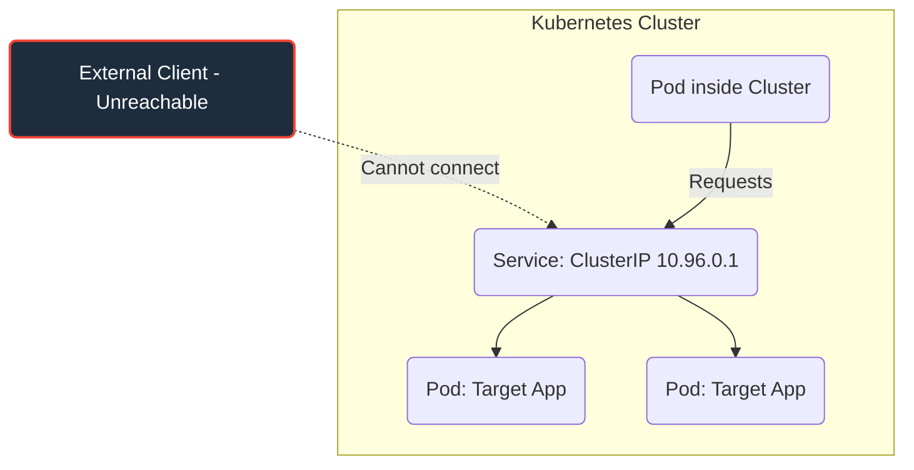
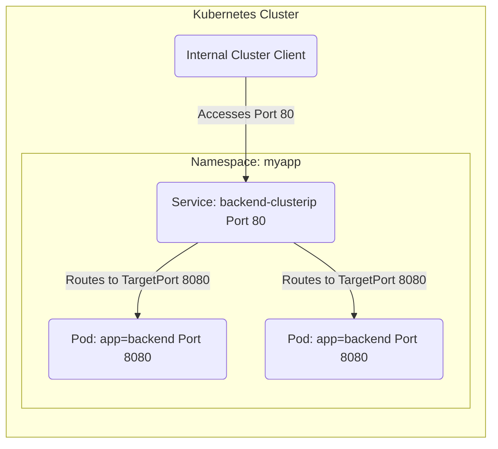
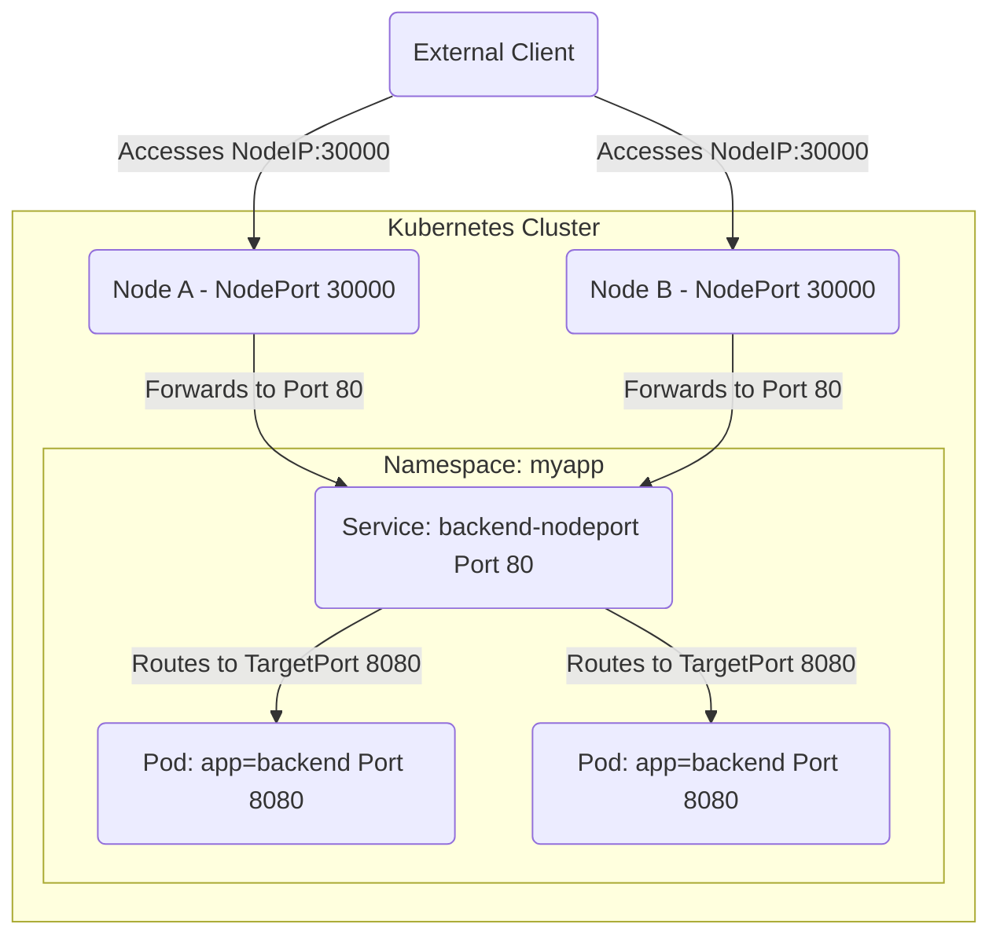
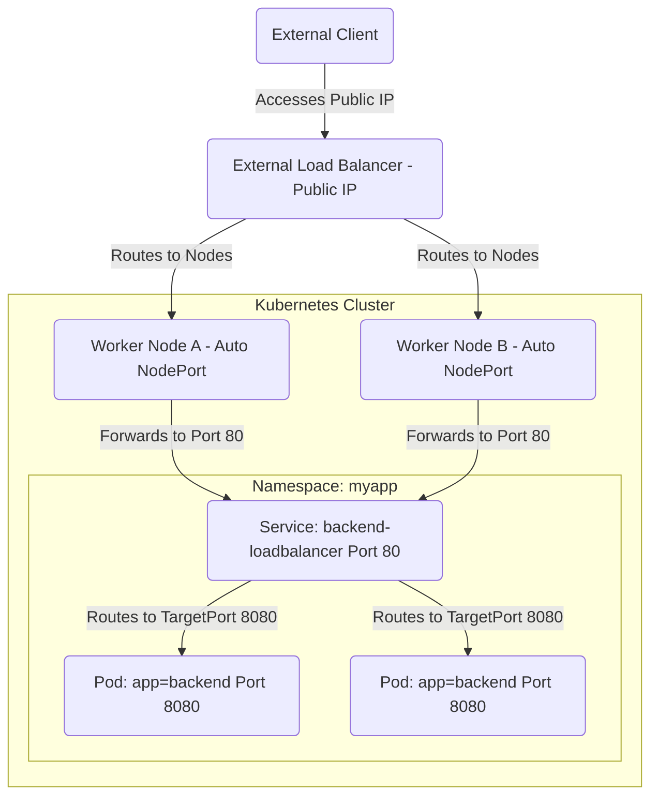

# Use ClusterIP, NodePort, LoadBalancer service types and endpoints

Pods are ephemeral. Therefore, placing these behind a service which provides a stable, static entrypoint is a fundamental use of the kubernetes service object. They can be one of the following types:

* `ClusterIP` - Internal only
* `NodePort` - External, requires access the nodes directly
* `LoadBalancer` - External, requires cloud provider, or software implementation to provide one

We can think of these services like loadbalancers, with automatic endpoint management based on label selectors.

## Cluster IP

This is the default service type which exposes a set of Pods via a cluster-internal IP. It cannot be reached from outside of the Kubernetes Cluster



The yaml for which looks like:

```yaml
apiVersion: v1
kind: Service
metadata:
  name: backend-clusterip
  namespace: myapp
spec:
  type: ClusterIP
  selector:
    app: backend
  ports:
    - port: 80
      targetPort: 8080
```

We define the service type in `spec.type`

We definite which Pods we want to target in `spec.selector`, where we specify the key:value pair of labels. For this specific example, it would look like:



## NodePort

A `nodePort` service works by exposing a high-value port directly on worker nodes. We can then direct traffic to one of these nodes on the specified port to access our application, even from outside of the cluster.



The corresponding yaml looks like:

```yaml
apiVersion: v1
kind: Service
metadata:
  name: backend-nodeport
  namespace: myapp
spec:
  type: NodePort
  selector:
    app: backend
  ports:
    - port: 80
      targetPort: 8080
      nodePort: 30000
```

## Loadbalancer

A `loadBalancer` service type exposes the service on a dedicated VIP, usually provided by a cloud provider or software-based solution (metallb, Cilium, etc).

Note we can consider the `loadBalancer` service type a wrapper around `NodePort`.



The yaml for which looks like:

```yaml
apiVersion: v1
kind: Service
metadata:
  name: backend-loadbalancer
  namespace: myapp
spec:
  type: LoadBalancer
  selector:
    app: backend
  ports:
    - port: 80
      targetPort: 8080
```

## Endpoints

Endpoints are essentially the destination points for a service traffic, regardless of type. They also provide a useful troubleshooting tool to determine if there are `Pods` active for a given service. For example:

```yaml
david@fedora:~/cka$ kubectl get endpoints argocd-redis -n argocd
# Note the Endpoints IP
NAME           ENDPOINTS       AGE
argocd-redis   10.0.1.4:6379   40d

# Note the IP address of the Pod
david@fedora:~/cka$ kubectl get po -n argocd -o wide | grep -i redis
argocd-redis-7f9487d4fd-knhpn                       1/1     Running   2 (8d ago)      24d   10.0.1.4     srv-rk1-01   <none>           <none>
```

We know the `argocd-redis` service has a single active endpoint.

!!! success "Exam Tip"

    Just because a service object has an IP address doesn't mean it will forward traffic to a working Pod.

!!! success "Exam Tip"

    If you're not getting traffic back from a `service` object, check its `endpoints`.

!!! success "Exam Tip"

    If a `service` object has endpoints, but is not returning any traffic, check which port it's forwarding traffic to on the `pod`, and which ports the `pod` is configured to listen on.