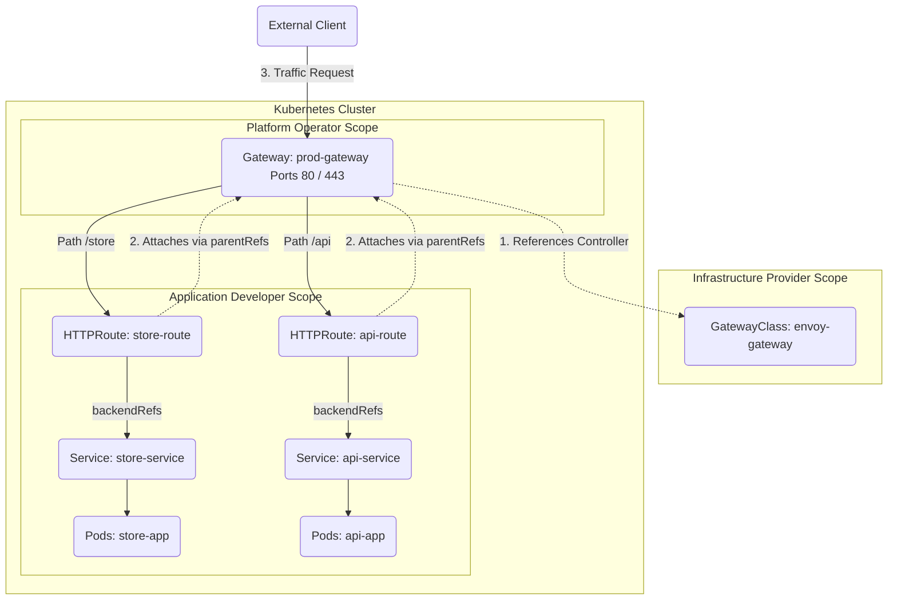
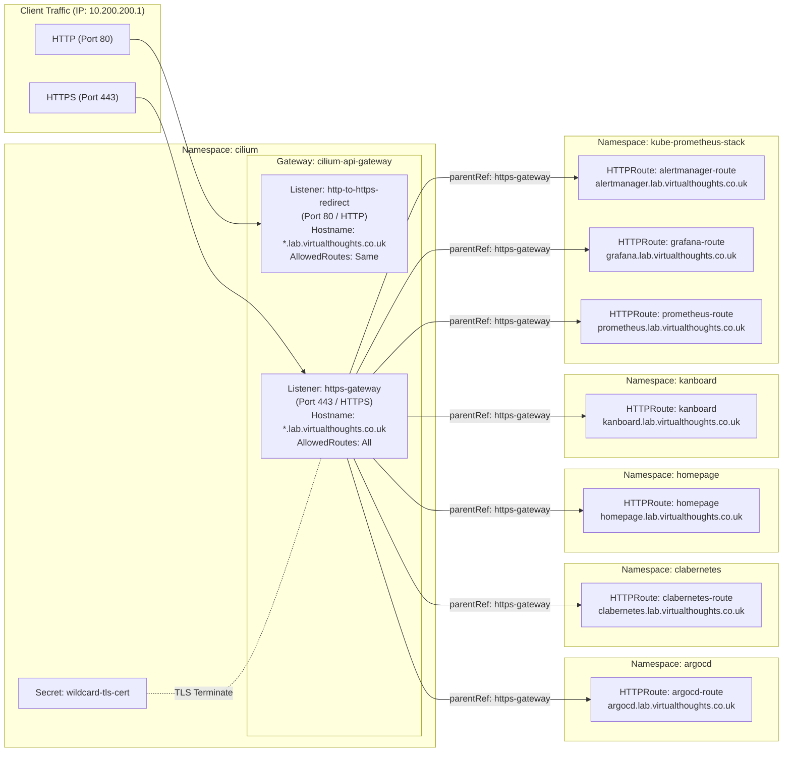

# Use the Gateway API to manage Ingress traffic

Gateway API is often considered the successor to Ingress and is designed to solve similar requirements whilst providing additional functionality.



Let's break down the components used:

## Components

1. **GatewayClass (Cluster Scoped):** Defined by the infrastructure provider. It acts as a template defining the controller that will manage the Gateways (similar to `IngressClass`).
2. **Gateway (Namespace Scoped):** Defined by the cluster operator. It represents an instance of a traffic-handling infrastructure, like a load balancer, listening on specific ports and protocols.
3. **HTTPRoute (Namespace Scoped):** Defined by the application developer. It specifies the rules for routing HTTP/HTTPS traffic from a Gateway to backend Kubernetes Services.

A CNI provider may already provide a `gatewayClass` object. For example with Cilium:

```bash
david@fedora:~/cka$ kubectl get gatewayclass
NAME     CONTROLLER                     ACCEPTED   AGE
cilium   io.cilium/gateway-controller   True       40d

david@fedora:~/cka$ kubectl describe gatewayclass cilium
Name:         cilium
Namespace:    
Labels:       app.kubernetes.io/managed-by=Helm
Annotations:  argocd.argoproj.io/tracking-id: cilium:gateway.networking.k8s.io/GatewayClass:cilium/cilium
              meta.helm.sh/release-name: cilium
              meta.helm.sh/release-namespace: cilium
API Version:  gateway.networking.k8s.io/v1
Kind:         GatewayClass
Metadata:
  Creation Timestamp:  2026-08-29T11:12:58Z
  Generation:          1
  Resource Version:    7931396
  UID:                 494f5ba8-b696-4029-bc1a-810d43708bb7
Spec:
  Controller Name:  io.cilium/gateway-controller
  Description:      The default Cilium GatewayClass
Status:
  Conditions:
    Last Transition Time:  2026-08-29T11:13:32Z
    Message:               Valid GatewayClass
    Observed Generation:   1
    Reason:                Accepted
    Status:                True
    Type:                  Accepted
  Supported Features:
    Name:  BackendTLSPolicy
    Name:  GRPCRoute
    Name:  GRPCRouteNamedRouteRule
    Name:  Gateway
    Name:  GatewayAddressEmpty
    Name:  GatewayFrontendClientCertificateValidationInsecureFallback
    Name:  GatewayHTTPListenerIsolation
    Name:  GatewayInfrastructurePropagation
    Name:  GatewayPort8080
    Name:  GatewayStaticAddresses
    Name:  HTTPRoute
    Name:  HTTPRoute303RedirectStatusCode
```

This provides are blueprint for `Gateway` objects which is similar to a `IngressController` - it sits in the datapath and is exposed by a service, such as:

```bash
david@fedora:~/cka$ kubectl get gateway -A
NAMESPACE   NAME                 CLASS    ADDRESS        PROGRAMMED   AGE
cilium      cilium-api-gateway   cilium   10.200.200.1   True         40d

david@fedora:~/cka$ kubectl describe gateway cilium-api-gateway -n cilium
Name:         cilium-api-gateway
Namespace:    cilium
Labels:       argocd.argoproj.io/instance=gateway-api-services
Annotations:  argocd.argoproj.io/tracking-id: gateway-api-gateways:gateway.networking.k8s.io/Gateway:cilium/cilium-api-gateway
              cert-manager.io/cluster-issuer: letsencrypt-prod
API Version:  gateway.networking.k8s.io/v1
Kind:         Gateway
Metadata:
  Creation Timestamp:  2026-08-29T11:16:49Z
  Generation:          2
  Resource Version:    7679879
  UID:                 dfceb435-fc56-4042-9af0-ab9ebeef0177
Spec:
  Gateway Class Name:  cilium
  Listeners:
    Allowed Routes:
      Namespaces:
        From:  Same
    Hostname:  *.lab.virtualthoughts.co.uk
    Name:      http-to-https-redirect
    Port:      80
...
```

`httpRoutes` are synonymous to `ingress` objects - they define a rule for routing traffic. For example:

```yaml
apiVersion: gateway.networking.k8s.io/v1
kind: HTTPRoute
metadata:
  name: argocd-route
  namespace: argocd
spec:
  hostnames:
  - argocd.lab.virtualthoughts.co.uk
  parentRefs:
  - group: gateway.networking.k8s.io
    kind: Gateway
    name: cilium-api-gateway
    namespace: cilium
    sectionName: https-gateway
  rules:
  - backendRefs:
    - group: ""
      kind: Service
      name: argocd-server
      port: 80
      weight: 1
    matches:
    - path:
        type: PathPrefix
        value: /
```

Key attributes include:

* `parentRefs` - Which `Gateway` object this route attaches to. A cluster may have several `Gateways`.
* `rules` - Where we direct traffic to. For example a internal `clusterIP`.

A fleshed out example (aka my homelab) looks like this



!!! success "Exam Tip"

    Check `parentRefs`. A common mistake is creating an `HTTPRoute` but failing to properly link it to the `Gateway` in the `parentRefs` section. Particularly if the gateway resides in a different namespace.

!!! success "Exam Tip"

    If routing isn't working, use `kubectl describe gateway <name>` and `kubectl describe httproute <name>` to check the `Conditions` and `Events` for controller-specific errors.