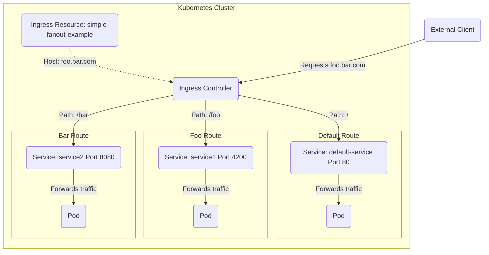

# Know how to use Ingress controllers and Ingress resources

Ingress exposes HTTP and HTTPS routes from outside the cluster to services within a cluster. Ingress consists of two components. The `Ingress` Resource is a collection of rules for the inbound traffic to reach Services. These are Layer 7 (L7) rules that allow hostnames (and optionally paths) to be directed to specific Services in Kubernetes. The second component is the `Ingress Controller` which acts upon the rules set by the Ingress Resource, typically via an HTTP or L7 load balancer. It is vital that both pieces are properly configured to route traffic from an outside client to a Kubernetes Service.

Let's take the following example:



The corresponding yaml creates two ingress rules for the website foo.bar.com along with the default:

* The default path will direct traffic to the service “default-service” which listens on port 80
* Paths ending in /foo will direct traffic to the service “service1” which listens on port 4200
* Paths ending in /bar will direct traffic to the service “service2” which listens on port 8080

```yaml
apiVersion: networking.k8s.io/v1
kind: Ingress
metadata:
  name: simple-fanout-example
spec:
  rules:
    - host: foo.bar.com
      http:
        paths:
          - path: /
            pathType: Prefix
            backend:
              service:
                name: default-service
                port:
                  number: 80
          - path: /foo
            pathType: Prefix
            backend:
              service:
                name: service1
                port:
                  number: 4200
          - path: /bar
            pathType: Prefix
            backend:
              service:
                name: service2
                port:
                  number: 8080
```

In order for the Ingress resource to work, the cluster must have an ingress controller running. Ingress controllers are deployed into the Kubernetes cluster as a workload:

```shell
> kubectl get po -A | grep nginx-ingress
ingress-nginx              nginx-ingress-controller-2gxtd                            1/1     Running     0          14d
ingress-nginx              nginx-ingress-controller-9lrzh                            1/1     Running     0          14d
ingress-nginx              nginx-ingress-controller-r2ksq                            1/1     Running     0          14d
```

The ingress controller itself is exposed as a `service` - Either `clusterIP`, `loadBalancer` or `nodePort` and acts as the entrypoint into the cluster for Ingress traffic.

!!! success "Exam Tip"

    Ingress is formed of two parts - the `controller` (in the datapah) and the `ingress` object itself (rules).

!!! success "Exam Tip"

    The ingress controller is exposed as a service, the service IP/FQDN is where we need to direct traffic to.